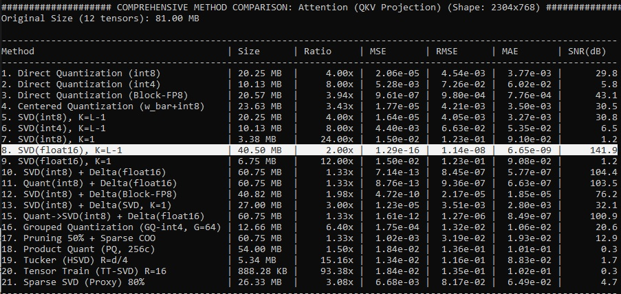

# A Comparative Analysis of Weight Compression Methods
An empirical study of 21 weight tensor compression methods revealed universal principles across diverse neural network architectures (Transformer and Convolutional) and enabled the formulation of quantitatively justified recommendations.

---

## 1. Methodology

**Weight Grouping:**
Weight tensors were grouped by functional role and shape to isolate semantically homogeneous data. This strategy enabled the application of methods that exploit inter-layer correlations, such as Singular Value Decomposition (SVD).

**Evaluation Metrics:**

| Metric            | Formula                                            | Purpose                                                                                                     |
|-------------------|----------------------------------------------------|-------------------------------------------------------------------------------------------------------------|
| MSE               | `MSE = mean((W - W_hat)^2)`                        | Sensitive to large outliers; measures the mean squared error of the approximation.                          |
| RMSE              | `RMSE = sqrt(MSE)`                                 | Provides a direct measure of the average error in the same units as the weights.                            |
| MAE               | `MAE = mean(abs(W - W_hat))`                       | A robust measure of the average error, less sensitive to outliers.                                          |
| SNR               | `SNR(dB) = 10 * log10(variance(W) / MSE)`          | A logarithmic metric representing the ratio of signal power to error power; key for method selection. |
| Compression Ratio | `CR = Original Size / Compressed Size`             | Quantifies the degree of memory savings.                                                                    |

*Here, `W` represents the original weight tensor, and `W_hat` represents the reconstructed tensor.*

**Standardized Testing Procedure:**
All methods were evaluated on identical weight groups under consistent memory form-factor assumptions and using the same set of metrics.

---

---

## 2. Key Findings

### Principle 1: The Universality of Inter-Layer Redundancy

*   **Method:** SVD(float16), K = L−1
*   **Results:** SNR = 141–145 dB, CR = 2.0× across all weight groups in both GPT-2 and ResNet-18.
*   **Conclusion:** Inter-layer weight redundancy is a fundamental property of deep architectures. Full-rank SVD allows for its nearly lossless elimination.

**Implication:**
Any compression method that disregards inter-layer correlation will inevitably be suboptimal in terms of reconstruction quality.

---

### Principle 2: The Superiority of Adaptive Quantization

*   **Block-FP8:** Achieved an SNR 10–24 dB higher than standard int8 (e.g., for GPT-2 FFN2 layers: 42 dB vs. 17.9 dB).
*   **Grouped Quantization (GQ-int4):** Proved to be the only viable 4-bit method, yielding an SNR of ~20 dB, whereas naive int4 dropped to 0.5–8 dB.

**Conclusion:**
Adaptive, localized scaling is essential for low-bit quantization. Naive global quantization leads to a catastrophic loss of information.

---

### Principle 3: The Efficacy of Hybrid Hierarchical Approaches

*   **Method:** SVD(int8) + Delta(SVD, K=1)
*   **Results:**
    *   GPT-2: SNR ~32 dB, CR ~3×
    *   ResNet-18: SNR up to 38.5 dB
*   **Interpretation:** This approach first compresses the principal components (SVD) and then encodes the residuals (delta), preserving high fidelity at a significant compression rate.

**Conclusion:**
Hierarchical compression is a powerful tool for balancing reconstruction quality and compression ratio.

---

### Ineffective and Niche Strategies

| Method                          | Issue                                                                                                            |
|---------------------------------|------------------------------------------------------------------------------------------------------------------|
| Tucker, TT-SVD                  | Extreme compression (up to 287×) but with SNR < 2 dB; the weight structure does not fit the tensor decomposition model. |
| Naive Pruning (50%)             | Severe quality degradation; SVD components remain dense and informative.                                         |
| Sparse SVD (80%)                | Sparsification does not reduce error effectively; SVD components are dense and ill-suited for pruning.             |

Methods relying on extreme sparsity or theoretical tensor decompositions lose their utility as general-purpose compressors without adaptation to the statistical properties of the weights.

---

## 3. Universal Principles

1.  **Full-rank SVD with float16** serves as the quality baseline for what is losslessly achievable.
2.  **Adaptive quantization of local blocks** enables low-bit storage with acceptable fidelity.
3.  **Hybrid hierarchical schemes** (SVD + delta) provide the best CR/SNR trade-off, especially for mid-range compression.
4.  **Global low-bit methods, sparsity, and theoretical tensor decompositions** are niche strategies with limited applicability.

For practical weight compression, a **universal strategy** is:

1.  Perform full-rank SVD(float16) to establish the baseline accuracy.
2.  Employ adaptive quantization (Block-FP8 / GQ-int4) to reduce size while preserving SNR.
3.  Use hierarchical compression (SVD + Delta) for a balanced CR/SNR compromise.

Methods like TT-SVD should only be considered in scenarios requiring extreme compression where quality is a low priority.

---

## License

The source code of this project is licensed under the **Apache License 2.0**. A full copy of the license is available in the `LICENSE` file in the root directory of this repository and can also be viewed at [https://www.apache.org/licenses/LICENSE-2.0](https://www.apache.org/licenses/LICENSE-2.0).

---
### Copyright (c) 2026 Dmitry Feklin (FeklinDN@gmail.com)
---
