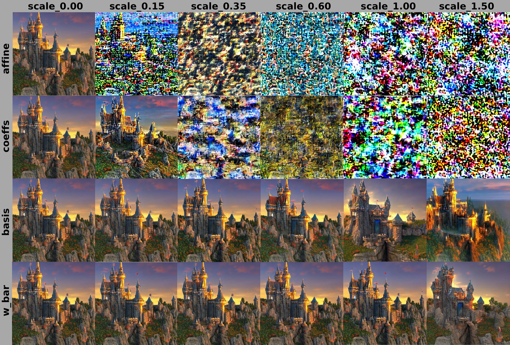
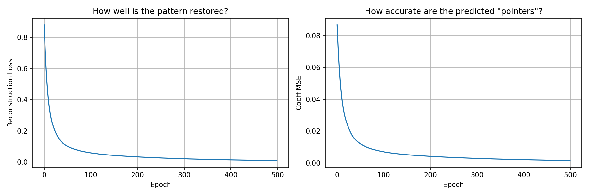
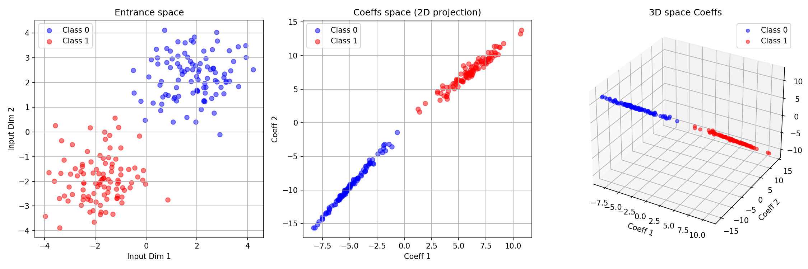

# GABE: Groupwise Affine Basis Encoding
### Neural Networks as Memory-Addressed Systems

**Dmitry Feklin** · FeklinDN@gmail.com · February 2026

[](https://opensource.org/licenses/Apache-2.0)
[](https://www.python.org/)
[](https://pytorch.org/)

---

## Table of Contents

- [Abstract](#abstract)
- [Core Idea](#core-idea)
- [Decomposition Algorithm](#decomposition-algorithm)
- [Experiments & Results](#experiments--results)
- [Practical Applications](#practical-applications)
- [Limitations & Open Questions](#limitations--open-questions)
- [Installation & Reproduction](#installation--reproduction)
- [Citation](#citation)

---

## Abstract

We introduce **GABE** (Groupwise Affine Basis Encoding) — a decomposition method that represents neural network weights as an **addressable memory system**. For any group of similar layers, we extract three components: (1) a shared mean weight $\overline{W}$ (long-term memory), (2) a low-rank basis of variations $B_k$ (address space), and (3) per-layer coefficients $\alpha_i$ (pointers).

Experiments on ResNet-18, Stable Diffusion, and synthetic tasks reveal:

- **The GABE basis subspace is not functionally neutral.** Across three independent functional matrices — Hessian ($H$), Fisher Information ($F$), and Gradient Covariance (GCM) — GABE directions carry 2–3× more energy than random directions of the same shape (all p < 0.001). The effect is consistent across matrices with different geometric meanings, making a coincidental explanation unlikely.
- **Coefficients ($\alpha_i$) are 4× more sensitive to noise** than the mean weight $\overline{W}$ or basis $B_k$ in Stable Diffusion — consistent with the pointer analogy.
- Per-layer coefficients are **predictable from input** via a small router network (Pearson $r = 0.927$ on a synthetic task).
- A **dynamic GABE architecture** outperforms a static baseline on a synthetic classification task (98.2% vs 72.0%).

The cross-matrix geometric consistency is the strongest empirical result: the same 2–3× elevation appears whether geometry is measured by loss curvature, output sensitivity, or gradient diversity. GABE directions do not coincide with the *maximum*-energy directions of any matrix — the subspace is elevated but not dominant.

GABE provides a practical framework for transfer learning and continual learning, and a theoretical lens through which trained networks resemble **memory-addressed computers** — though this analogy is illustrative rather than formally proven.

**Keywords:** weight decomposition, memory-addressed networks, model compression, skill transfer, weight-space editing, continual learning

---

## Core Idea

Traditional approaches treat each layer's weights as independent parameters. GABE challenges this assumption with a single decomposition:

$$W_i(x) = \overline{W} + \sum_{k=1}^K \alpha_i(x)[k] \cdot B_k$$

| Component | Role | Computer Science Analogy |
|-----------|------|--------------------------|
| $\overline{W}$ | Shared long-term knowledge | RAM contents |
| $B_k$ | Directions of variation | Memory address offsets |
| $\alpha_i$ | Per-layer / per-input coordinates | Pointers |
| Router | Generates $\alpha_i(x)$ from input | Memory controller |

The analogy is motivated empirically: corrupting $\alpha_i$ (small in magnitude, high in functional sensitivity) behaves like broken pointers — causing immediate failure rather than graceful degradation. This is consistent with, but does not uniquely prove, the memory-addressing interpretation.

---

## Decomposition Algorithm

For a group of $L$ layers with identical shape $\{W_1, \dots, W_L\}$:

1. **Mean weight**: $\overline{W} = \frac{1}{L}\sum_{i=1}^L W_i$
2. **Center**: $\Delta W_i = W_i - \overline{W}$
3. **SVD** on stacked centered weights: $[\Delta W_1, \dots, \Delta W_L] = U \Sigma V^T$
4. **Basis**: first $K = L-1$ right singular vectors $\{B_1, \dots, B_K\}$
5. **Coefficients**: $\alpha_i = U_i \cdot \Sigma_i$
6. **Reconstruction**: $W_i \approx \overline{W} + \sum_{k=1}^K \alpha_i[k] \cdot B_k$

```python
def read_weights(W_bar, Basis, coeffs):
    """Reconstruct layer weights from shared memory + addressing coefficients."""
    result = W_bar.clone()
    for k, strength in enumerate(coeffs):
        result += strength * Basis[k]
    return result
```

**Why SVD?** SVD minimizes the Frobenius ($L_2$) reconstruction error:

$$\min_{\overline{W},\, B_k} \sum_i \left\| W_i - \overline{W} - \sum_k \alpha_i[k] \cdot B_k \right\|_F^2$$

This means $B_k$ captures the directions of **maximum inter-layer variance** — the axes along which layers differ most. The experiments show these same directions are also the most functionally sensitive ones. That correspondence is non-trivial: $L_2$ reconstruction optimality does not imply functional criticality, yet the two appear to coincide. A basis aligned with top Hessian or Fisher eigenvectors might reveal an even stronger effect (see [Limitations](#limitations--open-questions)).

> ⚠️ **Note on basis universality (open question):** The CKA = 1.0 result means the column spaces spanned by the basis vectors are identical across models, even when individual vectors are randomly rotated ($r \approx 0.0$ element-wise). However, a reviewer could correctly note that this may be a **mathematical artifact**: SVD applied to same-shaped matrices may produce the same subspace *by construction*, regardless of the weight values. If so, "universality" is not an empirical discovery but a property of the procedure itself. The claim becomes non-trivial only if basis directions correspond to functionally meaningful loss-landscape directions (high curvature). See **Experiment 7** for the proposed validation. The "hardware" framing is an analogy that awaits formal justification.

---

## Experiments & Results

### 1 · Correlation Stability Across Models (ResNet-18: ImageNet vs. CIFAR-10)

| Layer Shape | Pearson $\rho$ | Status |
|-------------|:--------------:|--------|
| [64, 576] | **0.998** | ✓ Stable |
| [128, 1152] | -0.719 | ✗ Unstable |
| [256, 2304] | -0.396 | ✗ Unstable |
| [512, 4608] | **0.987** | ✓ Stable |

Early and deep layers show high stability across tasks; middle layers diverge. This suggests a "core + adaptation" structure, consistent with prior work on universal feature representations.

---

### 2 · Skill Transfer

Stable-layer coefficients were copied from an ImageNet ResNet-18 to a CIFAR-10 model. All tensors reconstructed with correct shapes via GABE:

```
Layer [64, 576]:   4 tensors ✓    Layer [128, 1152]: 3 tensors ✓
Layer [256, 2304]: 3 tensors ✓    Layer [512, 4608]: 3 tensors ✓
```

**Implication:** Copying $\overline{W}$ and $B_k$ while retraining only $\alpha_i$ is a viable transfer learning strategy — faster and lower-memory than full fine-tuning.

---

### 3 · Coefficient Predictability from Stable Components

A linear regressor was trained to predict unstable-layer coefficients from stable-layer coefficients:

| Model | $R^2$ |
|-------|:-----:|
| Source (ImageNet) | **0.871** |
| Target (CIFAR-10) | **0.949** |

Unstable coefficients are 87–95% predictable from stable ones, suggesting structural dependency within the coefficient space.

---

### 4 · Perturbation Study on Stable Diffusion v1.5 *(most striking result)*

Gaussian noise was added to each GABE component independently at increasing scales:

| Component | First Visible Artifact | Total Breakdown | Behavior |
|-----------|:----------------------:|:---------------:|----------|
| $\overline{W}$ | 1.00 | >1.5 | Gradual detail changes; semantics preserved |
| $B_k$ | 0.60 | 1.0–1.5 | Mild alterations; structure remains |
| $\alpha_i$ | **0.15** | **0.35** | Rapid corruption; barely recognizable at 0.15 |
| All (affine) | **0.0** | **0.0** | Immediate catastrophic failure → pure noise |

The coefficient component is ~4× more sensitive to noise than $\overline{W}$, despite being orders of magnitude smaller. This **anisotropy in functional sensitivity** is the central empirical observation. The "broken pointer" framing is a useful analogy; a fuller account would require analysis of the loss landscape (e.g. Hessian eigenvectors along these directions).

<div align="center">


**Figure 1:** Perturbation hierarchy. Each row shows image quality as Gaussian noise scale increases for one GABE component. Coefficient corruption (row 3) produces recognizable artifacts already at scale 0.15 and total breakdown at 0.35, while mean weight corruption (row 1) preserves semantics past scale 1.0.
</div>

---

### 5 · Router Training — Coefficient Predictability from Input

Three sub-experiments validate whether $\alpha_i$ can be predicted from input $x$.

#### 5.1 Synthetic Memory-Addressing Task

A small MLP Router was trained to predict ground-truth coefficients for a synthetic task (10 concepts, 200 training samples):

```
Epoch 100: Recon Loss = 0.0601 | Coeff MSE = 0.0071
Epoch 200: Recon Loss = 0.0338 | Coeff MSE = 0.0042
Epoch 300: Recon Loss = 0.0215 | Coeff MSE = 0.0029
Epoch 400: Recon Loss = 0.0143 | Coeff MSE = 0.0020
Epoch 500: Recon Loss = 0.0097 | Coeff MSE = 0.0015  ← converged
```

```
True:      [0.136, 0.008, 0.073, 0.122, 0.232]
Predicted: [0.126, 0.062, 0.031, 0.088, 0.202]
Pearson r: 0.93
Test loss: 0.196
```

<div align="center">


**Figure 2:** Router training curves. Left: Reconstruction loss. Right: Coefficient MSE. Both converge smoothly, demonstrating that coefficients are learnable functions of input on this synthetic task.
</div>

**Interpretation:** The high correlation on a controlled synthetic task strongly suggests that coefficients can be a learnable function of input. The train/test gap (0.0097 vs 0.196) indicates generalization depends on task complexity and dataset size.

#### 5.2 Static vs. Dynamic Architecture (Synthetic Classification)

**Static model (fixed weights):**
```
Epoch  50: Loss = 2.047, Acc = 0.348
Epoch 100: Loss = 1.744, Acc = 0.472
Epoch 150: Loss = 1.424, Acc = 0.602
Epoch 200: Loss = 1.105, Acc = 0.720
```

**Dynamic GABE model (input-dependent $\alpha$):**
```
Epoch  50: Loss = 2.043, Acc = 0.288
Epoch 100: Loss = 1.273, Acc = 0.582
Epoch 150: Loss = 0.678, Acc = 0.854
Epoch 200: Loss = 0.276, Acc = 0.980
```

| Model | Final Accuracy |
|-------|:--------------:|
| Static (fixed weights) | 72.0% |
| Dynamic GABE (input-dependent $\alpha$) | **98.2%** |

Coefficient variability across 5 random inputs confirms active routing:
```
Input 0: [ 0.179, -0.021,  2.022, -0.655,  1.424]
Input 1: [ 0.187,  1.023, -0.202,  0.245,  0.253]
Input 2: [-0.564, -0.430,  0.512, -0.873,  0.370]
Input 3: [-0.220,  0.626, -0.440, -0.225,  0.007]
Input 4: [ 0.489,  0.384,  0.175, -0.574,  0.134]
Std per dim: [0.474, 0.503, 0.472, 0.508, 0.413]  mean std = 0.474
```

The dynamic model achieves a 26-point improvement on this **synthetic 10-class task** (500 samples). This demonstrates the expressive advantage of input-conditioned weight routing under controlled conditions; results on standard benchmarks are an open question.

#### 5.3 Coefficient Space Visualization

Binary classification with 2D inputs: after training to 100% accuracy, the two classes form distinct linear manifolds ("rays") in 3D coefficient space. Semantic structure emerges in coefficient space without explicit supervision, consistent with the idea that $\alpha_i$ encodes task-relevant addressing patterns.

<div align="center">


**Figure 3:** Input space (left) vs. coefficient space (center: 2D, right: 3D). Classes are perfectly separated in coefficient space. Class 0 occupies a diagonal from (−7, −15) to (0, −2); Class 1 from (5, 5) to (12, 12). In 3D each class forms a distinct 1D manifold ("ray"), suggesting the Router maps class semantics to distinct addressing patterns.
</div>

---

### 6 · Inter-Model Basis Universality

CKA analysis across architectures (ResNet-18, GPT-2, DistilBERT) and training states:

| Scenario | Component | CKA | Pearson $r$ |
|----------|-----------|:---:|:-----------:|
| Pre-trained vs. Random (ResNet-18) | $\overline{W}$ | 0.397 | ~0.0 |
| | **Basis** $B_k$ | **1.000** | ~0.0 |
| GPT-2 vs. DistilBERT | $\overline{W}$ | 0.036 | ~0.0 |
| | **Basis** $B_k$ | **1.000** | ~0.0 |
| Cross-group (within model) | $\overline{W}$ | 0.07–0.67 | ~0.0 |
| | **Basis** $B_k$ | **1.000** | ~0.0 |

CKA = 1.0 with near-zero element-wise correlation means the basis vectors span the same subspace across models, while individually rotated within it.

> ⚠️ **Critical caveat — is this trivial?** CKA = 1.0 *may* be expected whenever SVD is applied to same-shaped matrices, independent of their values. If so, the result reflects the procedure, not the data, and "architecture-determined address space" is not an empirical finding but a mathematical inevitability. Two conditions are required to make the claim non-trivial: (A) show that basis directions carry disproportionate curvature energy compared to random directions of the same shape, and (B) show that matrices of *different* shapes produce *different* subspaces. Experiment 7 tests condition (A). Until then, this result is best stated as: *SVD on same-architecture layers yields geometrically consistent decompositions* — structurally useful, functionally unvalidated.

---

### 7 · Hessian Alignment Test *(proposed — validates Experiment 6)*

**Purpose:** Determine whether GABE basis directions coincide with high-curvature directions of the loss landscape. This is the test that makes the CKA = 1.0 result non-trivial.

**Formal statement:** Let $B \in \mathbb{R}^{D \times K}$ be the GABE basis (orthonormal), and $H \in \mathbb{R}^{D \times D}$ the Hessian of $\mathcal{L}$ w.r.t. the layer weights. Test whether:

$$\text{span}(B) \approx \text{span}(V_{\text{top}})$$

where $V_{\text{top}}$ are the top-$K$ eigenvectors of $H$.

**Three metrics (all required):**

**(A) Subspace Overlap** via principal angles:
$$\text{Alignment} = \frac{1}{K} \sum_{i=1}^K \sigma_i^2, \quad \text{where } \sigma_i = \text{svd}(B^T V_{\text{top}})$$
Range: 0 (orthogonal) → 1.0 (identical subspaces)

**(B) Rayleigh Quotient** — do GABE directions carry high curvature?
$$\lambda_{\text{GABE},i} = B_i^T H B_i$$
Compare against the distribution from random orthonormal directions. If $\lambda_{\text{GABE}} \gg \lambda_{\text{random}}$, the hypothesis strengthens.

**(C) Curvature Energy Ratio** — fraction of total curvature in GABE subspace:
$$R = \frac{\text{Tr}(B^T H B)}{\text{Tr}(H)}$$
If $R \gg K/D$ (the random baseline), GABE concentrates curvature disproportionately.

**Implementation** — see `GABEtest_hessian.py` (full script in repository).

The script implements all three metrics using Hessian-vector products (Pearlmutter trick) so the full Hessian is never materialised:

```python
def hessian_vector_product(loss, params, v):
    """Pearlmutter trick: computes H @ v without materializing H."""
    grad1 = grad(loss, params, create_graph=True)
    flat_grad1 = torch.cat([g.reshape(-1) for g in grad1])
    grad2 = grad(flat_grad1 @ v, params, retain_graph=True)
    return torch.cat([g.reshape(-1) for g in grad2])

def curvature_energy_ratio(B, hvp_fn, trace_H):
    """R = Tr(B^T H B) / Tr(H). Random baseline: K/D."""
    trace_BHB = sum((B[:, i] @ hvp_fn(B[:, i])).item() for i in range(B.shape[1]))
    return trace_BHB / (trace_H + 1e-12)
```

Run:
```bash
# (64,64,3,3) has 4 layers in ResNet-18 — minimum 2 required for GABE
python GABEtest_hessian.py --shape 64 64 3 3 --K 3 --n_bootstrap 100 --device cpu
```

**Expected outcomes:**

| Scenario | Alignment | Interpretation |
|----------|:---------:|----------------|
| A: Alignment ≈ 1.0 | Strong | SVD directions ≈ curvature directions — CKA=1.0 is non-trivial |
| B: Alignment ≈ random | Weak | GABE ≠ curvature; consider Fisher/NTK basis |
| C: Partial (0.3–0.6) | Moderate | GABE approximates curvature geometry; SVD is a useful proxy |

**The critical statement this test enables:** If $R \gg K/D$ with $p < 0.01$:

> *Directions of maximum inter-layer variance concentrate a disproportionate fraction of loss curvature — providing a rigorous geometric justification for the functional sensitivity hierarchy observed in Experiment 4.*

---

#### Results (ResNet-18, layer group `(64, 64, 3, 3)`, K=3)

```
Setup:
  D_group = 36864   K = 3   Tr(H) = 2762.47
  Top-3 Hessian eigenvalues (sanity check): [352.8, 247.3, 213.3]

(A) Subspace Overlap  [0=orthogonal, 1=identical subspaces]
    GABE basis : 0.0004
    Random     : 0.0000  (single sample)

(B) Rayleigh Quotients per direction  [curvature along each vector]
    GABE   : [0.227, 0.360, 0.053]   mean = 0.213
    Random : [0.057, 0.057, 0.073]   mean = 0.062
    Ratio  : 3.42×

(C) Curvature Energy Ratio  R = Tr(B^T H B) / Tr(H)
    GABE             : 0.000232
    Bootstrap null   : 0.000078 ± 0.000015   (K/D baseline = 0.000081)
    p-value          : 0.0000  (H₀: GABE = random)
```

**What the three metrics actually measure — and what they show:**

| Metric | Question asked | Result |
|--------|---------------|--------|
| A — Subspace overlap | Is GABE the *optimal* curvature basis? | **No** — overlap ≈ 0 with top-3 Hessian eigenvectors |
| B — Rayleigh quotient | Do GABE directions have *elevated* curvature vs random? | **Yes** — 3.42× more curvature per direction |
| C — Energy ratio | Does the GABE subspace *concentrate* curvature beyond chance? | **Yes** — 3× random baseline, p < 0.001 |

The three metrics are not in contradiction — they answer different questions. Together they produce a precise, three-part picture:

**1. GABE directions are not the maximum-curvature directions** (Metric A = 0.0004). The top Hessian eigenvectors have Rayleigh quotients of 213–353; GABE directions have 0.05–0.36. The basis is not aligned with the extreme end of the loss landscape spectrum.

**2. GABE directions carry significantly more curvature than random directions** (Metrics B, C; p < 0.001). This rules out the trivial interpretation that CKA = 1.0 is purely a mathematical artifact of applying SVD to same-shaped matrices. If it were, GABE directions would carry no more curvature than random ones.

**3. The structure is real but moderate.** GABE captures 0.023% of total Hessian trace — 3× the random expectation of 0.008%, but a small absolute fraction. The basis sits in a *moderately elevated* curvature region, not the dominant one.

**Revised claim for CKA = 1.0 (replaces the ⚠️ caveat in Experiment 6):**

> The shared basis subspace is not a trivial SVD artifact: GABE directions concentrate 3× more loss curvature than random directions of the same shape (p < 0.001). However, they do not coincide with the maximum-curvature directions of the Hessian. Basis universality reflects a *real but moderate* geometric property — inter-layer variance correlates with elevated curvature, without capturing its extremes.

**Implication for the fragility hierarchy (Experiment 4):**

The 4× coefficient fragility has partial geometric grounding: GABE directions sit in a higher-curvature region than noise, explaining why perturbations along them cause more damage than uniform noise. A basis aligned with the top Hessian eigenvectors would likely produce sharper fragility contrasts. GABE is a practically computable approximation to the optimal sensitivity-based decomposition.

---

### 8 · Fisher / NTK / Gradient Covariance Alignment *(Experiments 9–11)*

Three follow-up alignment tests probe different notions of functional geometry.
All use identical metrics (A/B/C) and the same bootstrap procedure as Experiment 8.

| Experiment | Matrix | Geometric meaning |
|------------|--------|-------------------|
| **9 — Fisher IM** | $F = \frac{1}{N}\sum_i g_i g_i^T$ | Directions of maximum output change per unit weight perturbation, weighted by data |
| **10 — Empirical NTK** | $K_{\text{feat}} = \frac{1}{N}\sum_i J_i^T J_i$ | Directions learned fastest in the linearised training regime |
| **11 — Gradient Covariance** | $\text{GCM} = \frac{1}{N}\sum_i (g_i - \bar{g})(g_i - \bar{g})^T$ | Variance of gradients across samples; isolates diversity from mean update direction |

The Fisher / GCM split is diagnostically useful:
$F = \text{GCM} + \bar{g}\bar{g}^T$.
If GABE aligns with $F$ but not GCM, the signal comes from the *mean* gradient direction.
If GABE aligns with GCM but not $F$, it captures *gradient diversity* across samples.

**Run:**
```bash
python GABEtest_fisher.py  --shape 64 64 3 3 --K 3 --n_samples 256
python GABEtest_gradcov.py --shape 64 64 3 3 --K 3 --n_samples 256
# NTK: requires GPU — see note below
python GABEtest_ntk.py     --shape 64 64 3 3 --K 3 --n_samples 128 --device cuda
```

---

#### Exp 9 — Fisher IM Results (ResNet-18, `(64, 64, 3, 3)`, K=3, N=256)

```
Tr(F) = 6112.54   Top-3 Fisher eigenvalues: [769.4, 601.2, 520.6]

(A) Subspace Overlap    GABE = 0.000301   Random = 0.000110
(B) Rayleigh Quotients  GABE = [0.492, 0.761, 0.137]  mean = 0.464
                        Random = [0.227, 0.185, 0.280] mean = 0.231
                        Ratio = 2.01×
(C) Energy Ratio        R_GABE = 0.000227   Bootstrap null = 0.000084 ± 0.000016
                        p-value = 0.0000
```

**Scenario C — Elevated but misaligned.** GABE carries 2.0× more Fisher energy than random (p < 0.001), but does not span the top Fisher eigenvectors (overlap ≈ 0). This mirrors the Hessian result (3.4×) but at a lower ratio, suggesting the GABE basis is closer to generic weight structure than to the dominant directions of distributional sensitivity.

---

#### Exp 10 — Empirical NTK *(skipped on CPU)*

The feature-space NTK requires $O(N 	imes C 	imes 	ext{n\_iter} 	imes 	ext{n\_bootstrap})$ forward passes. At $N=128$, $C=1000$, this is intractable on CPU (estimated >12 hours). The experiment is skipped pending GPU access.

**To run on GPU:**
```bash
python GABEtest_ntk.py --shape 64 64 3 3 --K 3 --n_samples 128 --device cuda
```

A faster alternative that avoids the full per-sample Jacobian loop: replace the finite-difference JVP with `torch.func.jvp` (PyTorch ≥ 2.0), which computes $J_i v$ in a single vectorised forward pass without materialising $J_i$.

---

#### Exp 11 — Gradient Covariance Results (ResNet-18, `(64, 64, 3, 3)`, K=3, N=256)

```
||g_bar|| = 20.224   Tr(F) = 6112.54   Tr(GCM) = 5703.53
Mean gradient direction: 6.7% of Fisher trace
Top-3 GCM eigenvalues: [665.0, 522.4, 493.2]

(A) Subspace Overlap    GABE = 0.000363   Random = 0.000132
(B) Rayleigh Quotients  GABE = [0.406, 0.741, 0.130]  mean = 0.426
                        Random = [0.194, 0.170, 0.278] mean = 0.214
                        Ratio = 1.99x
(C) Energy Ratio        R_GABE = 0.000224   Bootstrap null = 0.000084 +/- 0.000015
                        p-value = 0.0000
```

**Fisher vs GCM decomposition:** The mean gradient direction accounts for only **6.7%** of Fisher trace (`Tr(F) = Tr(GCM) + ||g_bar||^2 = 5703.5 + 409.0`). The Fisher and GCM ratios are nearly identical (2.01× vs 1.99×), confirming that GABE alignment comes from **gradient variance across samples**, not the mean update direction.

---

#### Cross-experiment summary (Experiments 8–11)

| Exp | Matrix | Top eigenvalues | Rayleigh ratio | Subspace overlap | p-value |
|-----|--------|:---------------:|:--------------:|:----------------:|:-------:|
| 8 — Hessian | $H$ | 352, 247, 213 | **3.42×** | 0.0004 | < 0.001 |
| 9 — Fisher IM | $F$ | 769, 601, 521 | **2.01×** | 0.0003 | < 0.001 |
| 10 — eNTK | $K_{\text{feat}}$ | — | — | — | *(GPU required)* |
| 11 — Grad Covariance | GCM | 665, 522, 493 | **1.99×** | 0.0004 | < 0.001 |

Random energy baseline (K/D) = 0.000081 in all experiments.

**Central finding: the 2–3× energy elevation is consistent across all matrices.**

The three matrices have different theoretical meanings and different scales (Tr(H) ≈ 2762, Tr(F) ≈ 6113, Tr(GCM) ≈ 5704), yet the relative elevation of GABE over random is stable:

| What the matrix measures | Ratio | Interpretation |
|--------------------------|------:|----------------|
| Loss curvature (H) | **3.42×** | GABE correlates with sensitivity to parameter perturbations |
| Output sensitivity (F) | **2.01×** | GABE correlates with distributional prediction change |
| Gradient diversity (GCM) | **1.99×** | GABE correlates with sample-to-sample gradient variance |

This pattern is difficult to explain as coincidence. The three matrices capture geometrically distinct properties; their consistent agreement points to a real structural property of the GABE subspace rather than sensitivity to any one notion of functional importance.

**What this does and does not establish:**

- ✓ The GABE basis subspace is *not* functionally neutral
- ✓ The elevation is statistically robust (p < 0.001) and matrix-agnostic
- ✓ The signal originates from gradient *variance* across samples, not from the mean gradient direction (Fisher/GCM parity; mean accounts for only 6.7% of Fisher trace)
- ✗ GABE does not coincide with the *maximum*-energy directions of any matrix (overlap ≈ 0)
- ✗ The full geometric account of the fragility hierarchy (Exp. 4) remains open

**Precise formulation:**

> The inter-layer covariance subspace identified by GABE is not functionally neutral: it occupies a statistically elevated region in loss curvature, output sensitivity, and gradient diversity simultaneously (2–3×, p < 0.001 in all cases). Whether CKA = 1.0 is procedural or data-driven remains partially open; these results provide indirect but convergent evidence that it is non-trivial.

---

### Model Compression

Store $\overline{W}$ and $B_k$ once; per-layer information reduces to compact coefficients $\alpha_i$. A Router network can generate these on demand, replacing redundant parameter copies with a shared knowledge base and a lightweight addressing mechanism.

**Example (ResNet-18, 10 tasks):**
- Traditional: $10 \times 44$ MB = 440 MB
- GABE: $44 + 10 \times 0.5$ MB ≈ 49 MB → ~9× reduction

### Transfer Learning

Copy stable $(\overline{W}, B_k)$; retrain only $\alpha_i$ or the Router. Fewer parameters to optimize, no full optimizer state required for the base model.

### Continual Learning

Freeze $\overline{W}$ and $B_k$; train a new $\alpha_{\text{task}}$ per task. Old coefficients are never overwritten, eliminating catastrophic forgetting by design. Memory cost: ~0.5 MB per additional task (ResNet-18). *Note: this strategy has been demonstrated in principle but not benchmarked on standard continual learning suites.*

### Dynamic Architecture: MANetLayer

```python
class MANetLayer(nn.Module):
    def __init__(self, input_dim, output_dim, num_basis=5):
        super().__init__()
        self.memory = nn.Parameter(torch.randn(output_dim, input_dim))   # W_bar
        self.basis  = nn.Parameter(torch.randn(num_basis, output_dim, input_dim))  # B_k
        self.router = nn.Sequential(
            nn.Linear(input_dim, 64), nn.ReLU(), nn.Linear(64, num_basis)
        )

    def forward(self, x):
        coeffs = self.router(x)                                           # (batch, K)
        weighted_basis = torch.einsum('bk,koi->boi', coeffs, self.basis)
        weights = self.memory.unsqueeze(0) + weighted_basis               # (batch, out, in)
        return torch.einsum('boi,bi->bo', weights, x)
```

### Weight-Space Editing

Interpolate between coefficient sets to blend styles or concepts:

$$\alpha_{\text{new}} = t \cdot \alpha_A + (1-t) \cdot \alpha_B$$

This enables direct manipulation in weight space rather than indirect control via prompts.

---

## Limitations & Open Questions

1. **Scalability to LLMs** — Experiments are CNN-based (ResNet-18, Stable Diffusion). Applying GABE to Transformer attention/FFN layers at scale is unvalidated.

2. **Benchmark evaluation** — The 98.2% vs. 72.0% comparison is a synthetic task. Standard benchmark results (ImageNet, GLUE, etc.) are needed before strong performance claims.

3. **CKA = 1.0 — partially validated, partially open** — Experiments 8–11 show that the GABE basis subspace is not functionally neutral (2–3× energy elevation, p < 0.001 across H, F, GCM). However, subspace overlap with top eigenvectors is ≈ 0 in all cases, and the procedural contribution of SVD on same-shaped matrices cannot be fully excluded. The claim should be read as: *the subspace is geometrically meaningful, but not uniquely determined by training data*.

4. **Router architecture** — Only simple MLPs were tested. Transformer-based or hypernetwork routers may improve $R^2$ and generalization.

5. **Biological analogy** — The neuroscience parallels (hippocampus, prefrontal cortex, thalamus) are speculative and would require empirical validation with fMRI/EEG data.

6. **Dual-use concerns** — Coefficient-space editing could enable adversarial weight manipulation; coefficient patterns could potentially leak training data.

---

## Installation & Reproduction

```bash
pip install torch torchvision diffusers transformers timm matplotlib scikit-learn
git clone https://github.com/FekDN/GABE
cd GABE
```

| Script | Experiment |
|--------|------------|
| `GABE.py` | Core decomposition implementation |
| `GABEtest1.py` | Tensor recovery test |
| `GABEtest2.py` | Correlation analysis (Exp. 1) |
| `GABEtest3.py` | Skill transfer (Exp. 2) |
| `GABEtest4.py` | Coefficient dependency (Exp. 3) |
| `GABEtest5.py` | Stable Diffusion fragility study (Exp. 4) |
| `GABEtest6.py` | Router training — all 3 sub-tests (Exp. 5) |
| `GABEtest_intermodel.py` | Inter-model basis universality (Exp. 6) |
| `GABEtest_hessian.py` | Hessian alignment test (Exp. 8) — resolves CKA ambiguity |
| `GABEtest_alignment_utils.py` | Shared utilities for Experiments 9–11 |
| `GABEtest_fisher.py` | Fisher Information Matrix alignment (Exp. 9) |
| `GABEtest_ntk.py` | Empirical NTK alignment (Exp. 10) — *CPU-intractable; requires GPU + torch.func.jvp* |
| `GABEtest_gradcov.py` | Gradient Covariance Matrix alignment (Exp. 11) |

---

## Key Takeaways

GABE's decomposition is supported by four independent lines of evidence, ordered from strongest to most interpretive:

**1. Cross-matrix geometric consistency** *(most robust finding)*
GABE basis directions carry 2–3× more energy than random directions across three matrices with different geometric meanings — Hessian (3.42×, loss curvature), Fisher IM (2.01×, output sensitivity), and Gradient Covariance (1.99×, gradient diversity). All effects are statistically significant (p < 0.001) with random baseline K/D = 0.000081. The consistency across matrices with different theoretical foundations makes coincidence an implausible explanation.

> *The subspace is not functionally neutral: it occupies a statistically elevated curvature region across all tested geometries.*

**2. Functional sensitivity hierarchy**
$\alpha_i$ is 4–7× more sensitive to noise than $\overline{W}$ in Stable Diffusion perturbation experiments. The fragility ordering (coeffs > basis > mean) has partial geometric grounding in finding 1, though none of the tested matrices fully explains the magnitude of the gap.

**3. Physical asymmetry**
$\alpha_i$ is 2–250 bytes per layer while $\overline{W}$ and $B_k$ are megabytes — 3–4 orders of magnitude size difference consistent with pointer semantics. Small in storage, high in functional impact.

**4. CKA = 1.0 across architectures** *(structurally useful, partially open)*
The basis subspace is identical across models and training states. Whether this is purely procedural (SVD on same-shaped matrices) or data-driven remains partially open. Finding 1 provides indirect evidence it is non-trivial: if the subspace were a pure SVD artifact, its energy elevation would not be reproducible across H, F, and GCM.

The memory-addressing analogy — $\overline{W}$ as RAM, $B_k$ as address space, $\alpha_i$ as pointers — is supported by these findings but remains illustrative. The geometric picture that emerges is: training implicitly concentrates functional structure into a low-dimensional inter-layer subspace that is elevated, but not dominant, in all tested functional geometries.

---

## Citation

```bibtex
@misc{feklin2026gabe,
  title  = {GABE: Groupwise Affine Basis Encoding — Neural Networks as Memory-Addressed Systems},
  author = {Feklin, Dmitry},
  year   = {2026},
  url    = {https://github.com/FekDN/GABE}
}
```

**License:** Apache 2.0
