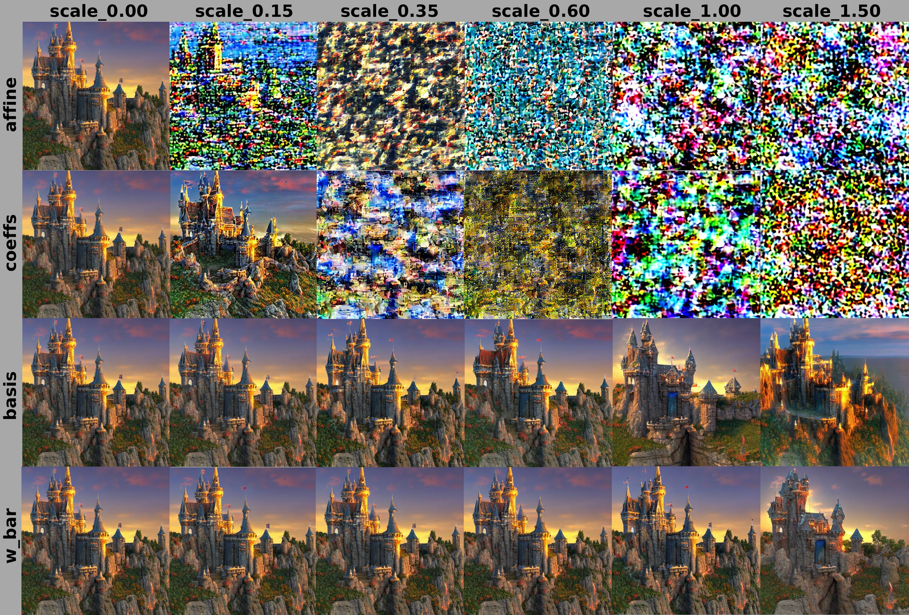
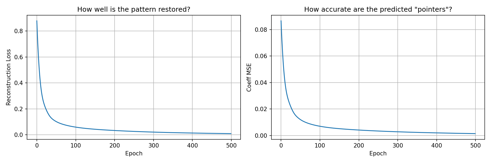
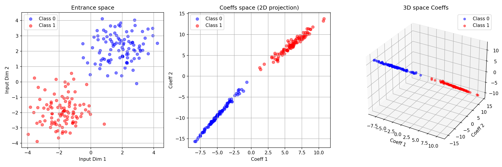

# GABE: Groupwise Affine Basis Encoding
### Neural Networks as Memory-Addressed Systems

**Dmitry Feklin** · FeklinDN@gmail.com · February 2026

[](https://opensource.org/licenses/Apache-2.0)
[](https://www.python.org/)
[](https://pytorch.org/)

---

## Table of Contents

- [Abstract](#abstract)
- [Core Idea](#core-idea)
- [Decomposition Algorithm](#decomposition-algorithm)
- [Fisher / Hessian Computation — Methodology](#fisher--hessian-computation--methodology)
- [Experiment Overview](#experiment-overview)
- [Experiments & Results](#experiments--results)
  - [Exp 1 · Correlation Stability Across Models](#exp-1--correlation-stability-across-models-resnet-18-imagenet-vs-cifar-10)
  - [Exp 2 · Skill Transfer](#exp-2--skill-transfer)
  - [Exp 3 · Coefficient Predictability from Stable Components](#exp-3--coefficient-predictability-from-stable-components)
  - [Exp 4 · Perturbation Study on Stable Diffusion](#exp-4--perturbation-study-on-stable-diffusion-v15)
  - [Exp 5 · Router Training — Coefficient Predictability from Input](#exp-5--router-training--coefficient-predictability-from-input)
  - [Exp 6 · Inter-Model Basis Universality](#exp-6--inter-model-basis-universality)
  - [Exp 7 · Hessian Alignment Test (proposed)](#exp-7--hessian-alignment-test-proposed--validates-experiment-6)
  - [Exp 8 · Hessian Alignment Results](#exp-8--hessian-alignment-results)
  - [Exp 9 · Fisher Information Matrix Alignment](#exp-9--fisher-information-matrix-alignment)
  - [Exp 10 · Empirical NTK Alignment](#exp-10--empirical-ntk-alignment)
  - [Exp 11 · Gradient Covariance Alignment](#exp-11--gradient-covariance-alignment)
  - [Cross-Experiment Summary (Exp 8–11)](#cross-experiment-summary-exp-811)
  - [Exp 12 · Spectral Percentile Analysis](#exp-12--spectral-percentile-analysis)
  - [Exp 13 · Seed Reproducibility](#exp-13--seed-reproducibility)
  - [Exp 14 · Depth Sweep](#exp-14--depth-sweep)
  - [Exp 15 · Width Sweep](#exp-15--width-sweep)
  - [Exp 16 · Initialization Control](#exp-16--initialization-control)
  - [Exp 17 · Cross-Layer Type Test](#exp-17--cross-layer-type-test)
  - [Exp 19 · Fine-Tuning Drift](#exp-19--fine-tuning-drift)
  - [Exp 20b · α-Editing with Relative Noise Normalization](#exp-20b--editing-with-relative-noise-normalization)
  - [Exp 21 · Continual Learning Chain](#exp-21--continual-learning-chain)
  - [Exp 22 · Cross-Architecture Test](#exp-22--cross-architecture-test)
  - [Exp 24 · Steering Vector Overlap](#exp-24--steering-vector-overlap)
  - [Exp 25 · Training Dynamics Tracking](#exp-25--training-dynamics-tracking)
  - [Exp 26b · ATen Group Chain vs span(B) and w\_bar](#exp-26b--aten-group-chain-vs-spanb-and-w_bar)
  - [Exp 28 · Epoch-Matched Cross-Architecture Alignment](#exp-28--epoch-matched-cross-architecture-alignment)
  - [Exp 29 · Component Drift Under Fine-Tuning](#exp-29--component-drift-under-fine-tuning-distilbert--sst-2)
  - [Exp 30 · KV-Cache Compression with GABE](#exp-30--kv-cache-compression-with-gabe-gpt-2)
  - [Exp 31 · Tucker-GABE — Rayleigh Alignment in Kernel Space](#exp-31--tucker-gabe--rayleigh-alignment-in-kernel-space)
  - [Exp 32 · Zero-Shot Geometry Probe on Llama 3 8B](#exp-32--zero-shot-geometry-probe-on-llama-3-8b)
  - [GABE Fine-Tuning — ResNet-18 New-Class Learning (4-shot)](#gabe-fine-tuning--resnet-18-new-class-learning-4-shot)
  - [GABE Fine-Tuning — GPT-2 New Text Domain](#gabe-fine-tuning--gpt-2-new-text-domain-the-catastrophic-forgetting-test)
- [The B₃ Phenomenon and Effective Functional Rank](#the-b-phenomenon-and-effective-functional-rank)
- [Practical Applications](#practical-applications)
- [Limitations & Open Questions](#limitations--open-questions)
- [Planned Controls](#planned-controls)
- [Evidence Status](#evidence-status)
- [Installation & Reproduction](#installation--reproduction)
- [Key Takeaways](#key-takeaways)
- [Citation](#citation)

---

## Abstract

We introduce **GABE** (Groupwise Affine Basis Encoding) — a decomposition method that represents neural network weights as an **addressable memory system**. For any group of similar layers, we extract three components: (1) a shared mean weight $\overline{W}$ (long-term memory), (2) a low-rank basis of variations $B_k$ (address space), and (3) per-layer coefficients $\alpha_i$ (pointers).

Experiments on ResNet-18, Stable Diffusion, and synthetic tasks reveal:

- **The GABE basis is not functionally neutral.** Two of three basis directions ($B_1$, $B_2$) exceed the **99th percentile** of the empirical Rayleigh spectrum simultaneously in Hessian, Fisher, and Gradient Covariance matrices. The third direction ($B_3$) is near-random (~35th percentile). Mean spectral position: 79th percentile, stable across all three matrices (spread < 2%). SVD rank order predicts functional significance.
- **Coefficients ($\alpha_i$) are 4× more sensitive to noise** than the mean weight $\overline{W}$ or basis $B_k$ in Stable Diffusion — consistent with the pointer analogy.
- Per-layer coefficients are **predictable from input** via a small router network (Pearson $r = 0.927$ on a synthetic task).
- A **dynamic GABE architecture** outperforms a static baseline on a synthetic classification task (98.2% vs 72.0%).

The cross-matrix geometric consistency is the strongest empirical result. Experiment 12 (spectral percentile analysis, 2000 CDF samples × 3 matrices) provides the precise picture: $B_1$ and $B_2$ exceed the **99th percentile** of the empirical Rayleigh spectrum in all three matrices; $B_3$ sits at the ~35th percentile (near-random). Mean position: **79th percentile**, stable across H, F, and GCM (spread < 2%). SVD rank order predicts functional significance. The subspace does not coincide with the *top* eigenvectors of any matrix, but two of three basis directions sit above 99% of all directions in every tested geometry.

GABE provides a practical framework for transfer learning and continual learning, and a theoretical lens through which trained networks resemble **memory-addressed computers** — though this analogy is illustrative rather than formally proven.

**Keywords:** weight decomposition, memory-addressed networks, model compression, skill transfer, weight-space editing, continual learning

---

## Core Idea

Traditional approaches treat each layer's weights as independent parameters. GABE challenges this assumption with a single decomposition:

$$W_i(x) = \overline{W} + \sum_{k=1}^K \alpha_i(x)[k] \cdot B_k$$

| Component | Role | Computer Science Analogy |
|-----------|------|--------------------------|
| $\overline{W}$ | Shared long-term knowledge | RAM contents |
| $B_k$ | Directions of variation | Memory address offsets |
| $\alpha_i$ | Per-layer / per-input coordinates | Pointers |
| Router | Generates $\alpha_i(x)$ from input | Memory controller |

The analogy is motivated empirically: corrupting $\alpha_i$ (small in magnitude, high in functional sensitivity) behaves like broken pointers — causing immediate failure rather than graceful degradation. This is consistent with, but does not uniquely prove, the memory-addressing interpretation.

---

## Decomposition Algorithm

For a group of $L$ layers with identical shape $\{W_1, \dots, W_L\}$ where each flattened weight vector has dimension $D$:

1. **Stacking**: Flatten and stack the weights into a matrix $W \in \mathbb{R}^{L \times D}$.
2. **Mean weight**: $\overline{W} = \frac{1}{L}\sum_{i=1}^L W_i$ (row-wise mean).
3. **Center**: $\Delta W = W - \overline{W}$ (broadcasting the mean).
4. **Exact SVD**: Perform Singular Value Decomposition on the centered stack: $\Delta W = U \Sigma V^T$. For optimal numerical stability (especially in large models), this step is executed in `float64`.
5. **Basis**: The basis $B \in \mathbb{R}^{K \times D}$ consists of the first $K = L-1$ right singular vectors (rows of $V^T$).
6. **Coefficients**: $\alpha = U_K \Sigma_K \in \mathbb{R}^{L \times K}$.
7. **Reconstruction**: $W \approx \overline{W} + \alpha B$. The flattened tensors are then reshaped back to their original architectural dimensions.

**Grouping Strategy:** Layers are grouped strictly by their exact tensor shapes and architectural roles. For example, in GPT-2, all 12 `attn.c_proj` layers (shape `[768, 768]`) form a single group with $L=12$. A standard ResNet-18 yields four primary groups mapping to its four stage widths.

```python
def read_weights(W_bar, Basis, coeffs):
    """Reconstruct layer weights from shared memory + addressing coefficients."""
    result = W_bar.clone()
    for k, strength in enumerate(coeffs):
        result += strength * Basis[k]
    return result
```

**Why SVD?** SVD minimizes the Frobenius ($L_2$) reconstruction error:

$$\min_{\overline{W},\, B_k} \sum_i \left\| W_i - \overline{W} - \sum_k \alpha_i[k] \cdot B_k \right\|_F^2$$

This means $B_k$ captures the directions of **maximum inter-layer variance** — the axes along which layers differ most. The experiments show these same directions are also the most functionally sensitive ones. That correspondence is non-trivial: $L_2$ reconstruction optimality does not imply functional criticality, yet the two appear to coincide. A basis aligned with top Hessian or Fisher eigenvectors might reveal an even stronger effect (see [Limitations](#limitations--open-questions)).

> **Note on basis universality — resolved (Exp 26b):** The CKA = 1.0 result (Exp 6) was initially flagged as a potential SVD arithmetic artifact. Exp 26b (ATen Group Chain, 2026) directly tests the cause via a 2×2 controlled experiment: the dominant factor is **shared optimisation trajectory** (same seed → same initialisation + same data order), not the ATen op graph and not SVD arithmetic. Different architectures (Plain, BN, Skip) trained from the same seed converge to span(B) alignment 2387× above random; the same architecture from different seeds lands at the random baseline (1×). CKA = 1.0 is therefore real but procedural: two models that walk the same loss-landscape path produce identical GABE components. The "hardware" framing remains an analogy — $\overline{W}$ and $B_k$ are now best understood as **trajectory fingerprints** rather than architecture-determined address spaces.

---

## Fisher / Hessian Computation — Methodology

> **This section must be read before interpreting any percentile or Rayleigh quotient result.**

All spectral claims rest on the following approximation. Reviewers wishing to reproduce results need these details explicitly.

**Approximation used:** Empirical Fisher (outer product of per-sample gradients), not the full Hessian and not the diagonal Fisher.

$$F_{\text{emp}} = \frac{1}{N} \sum_i \nabla_W \ell(x_i) \otimes \nabla_W \ell(x_i)$$

**Matrix-vector products (MVP)** are computed without materializing F:

```python
def fisher_mvp(v, grads):          # grads: [N, D]
    scores = grads @ v             # [N]
    return (grads.T @ scores) / N  # [D]
```

**Gradient samples:** `n_grad` is reported per experiment (32–64). This is a low-sample approximation; increasing `n_grad` improves MVP fidelity. A sensitivity ablation over `n_grad ∈ {32, 128, 512, full}` is planned.

**Rayleigh quotient percentile:** For a direction `v`, compute `v^T F v`, then report its percentile within the empirical CDF over `n_rand = 1000` random unit vectors drawn uniformly from the D-sphere.

**The central unverified causal question:** These experiments show that `span(B)` has an elevated Rayleigh quotient. They do *not* show that variance alignment *causes* high curvature, as opposed to correlating with pre-existing geometry. The reverse direction — taking top-k eigenvectors of H and measuring their inter-layer variance explanation — has not been tested. This is the most important missing control (see [Planned Controls](#planned-controls)).

---

## Experiment Overview

| Script | Exp | Question | Verdict |
|--------|:---:|----------|---------|
| `GABEtest2.py` | 1 | Is span(B) stable across tasks (ImageNet vs CIFAR-10)? | Stable at early/late layers; middle layers diverge |
| `GABEtest3.py` | 2 | Can stable coefficients transfer between tasks? | Viable transfer strategy |
| `GABEtest4.py` | 3 | Are unstable coefficients predictable from stable ones? | 87–95% predictable ($R^2$) |
| `GABEtest5.py` | 4 | Is α more fragile than W̄ and B_k in Stable Diffusion? | α breaks at 4× lower noise |
| `GABEtest6.py` | 5 | Can α be predicted from input via a router? | r = 0.93; dynamic 98.2% vs static 72.0% |
| `GABEtest_intermodel.py` | 6 | Is span(B) identical across architectures (CKA)? | CKA = 1.0; trivially-or-not is open |
| `GABEtest_hessian.py` | 7/8 | Do B_k directions align with Hessian curvature? | 3.42× above random, p < 0.001; not top eigenvectors |
| `GABEtest_fisher.py` | 9 | Alignment with Fisher IM? | 2.01×, p < 0.001 |
| `GABEtest_ntk.py` | 10 | Alignment with empirical NTK? | Skipped (GPU required) |
| `GABEtest_gradcov.py` | 11 | Alignment with Gradient Covariance? | 1.99×, p < 0.001 |
| `GABEtest_spectrum.py` | 12 | Exact spectral percentile of each B_k in H/F/GCM? | B₁, B₂ at 100th pct; B₃ at ~35th pct |
| `GABEtest_seed.py` | 13 | Is span(B) stable across seeds? | Partially stable — 3.16× above random |
| `GABEtest_depth.py` | 14 | Does elevation scale with L? | Mixed — 100th at L=2, 81.9th at L=4 |
| `GABEtest_width.py` | 15 | Does elevation vanish as D grows? | Robust — ratio 3.64× to 26.69× with D |
| `GABEtest_init.py` | 16 | When does spectral structure emerge? | Learned — 57.8th at init → 98.7th at epoch 20 |
| `GABEtest_layertype.py` | 17 | Is elevation consistent across layer types? | Uniform 100th across all ResNet-18 groups |
| `GABEtest_finetune.py` | 19 | Does span(B) drift after fine-tuning? | Stable — alignment 0.9996 |
| `GABEtest_alpha_edit2.py` | 20b | Is α more sensitive per unit perturbation than W̄? | ε₅₀ ratio 4×, KL ratio 18× (B_k control missing) |
| `GABEtest_continual.py` | 21 | Can frozen (W̄, B_k) eliminate catastrophic forgetting? | Zero forgetting; accuracy at chance (~49%) |
| `GABEtest_crossarch.py` | 22 | Does elevation generalise across architectures? | Universal — ResNet, VGG-11, MobileNetV2; depthwise at chance |
| `GABEtest_steering.py` | 24 | Do class gradients align with span(B)? | Suggestive — 2.98× above random; no significance test |
| `GABEtest_dynamics.py` | 25 | When does B lock in during training? | Elevation >70th at epoch 1; full convergence at epoch 30 |
| `GABEtest_aten2.py` | 26b | Does ATen op chain or seed determine span(B) and w̄? | Seed dominant (2387× vs 1×); op chain has no effect |
| `GABEtest_epoch_match.py` | 28 | Is cross-arch alignment inflated by epoch mismatch? | Not inflated for AdamW/SGD; RMSprop requires matching |
| `GABEtest_component_drift.py` | 29 | How do W̄, α, B_k drift under fine-tuning (DistilBERT)? | W̄ dominates adaptation; α rigid; B_k stable (394K× above random) |
| `GABEtest_kvcache.py` | 30 | Can GABE compress the KV-cache at inference time? | Activation compression failed (PPL +628%+); α routing confirmed (r=0.905) |
| `GABEtest_tucker.py` | 31 | Does Tucker projection preserve Rayleigh alignment in kernel space? | Preserved at r≥8 for 128×128+ groups; r=32 for 64×64 |
| `GABEtest_new_class_v1.py` | FT-CV | GABE as PEFT for 4-shot new-class learning (ResNet-18)? | GABE_FT ≈ FULL_FT; KL(FULL\|\|GABE)=0.000002; 3× param reduction |
| `GABEtest_gpt2_v6.py` | FT-LM | GABE as PEFT for LLM domain adaptation (GPT-2)? | Best PPL 116.47 vs FULL_FT 646.40; 12.4× memory reduction |
| `GABEtest_gpt2_v8.py` | FT-LM2 | Static vs adaptive basis re-extraction during GABE_FT? | SA=1.0 after re-extraction; zero reconstruction penalty |
| `llama3_geometry_probe.py` | **32** | Do GABE curvature alignment and B₃ phenomenon hold on Llama 3 8B? | B1 6.50×, B2 5.43×; B3 ≈ 1.09× (random); recon err 6.1e-14 at D=58M |

---

## Experiments & Results

### Exp 1 · Correlation Stability Across Models (ResNet-18: ImageNet vs. CIFAR-10)

**Script:** `GABEtest2.py`

GABE was applied to ResNet-18 models trained on ImageNet and CIFAR-10. Pearson correlation of basis coefficients was measured across layer groups of the same shape.

| Layer Shape | Pearson $\rho$ | Status |
|-------------|:--------------:|--------|
| [64, 576] | **0.998** | ✓ Stable |
| [128, 1152] | -0.719 | ✗ Unstable |
| [256, 2304] | -0.396 | ✗ Unstable |
| [512, 4608] | **0.987** | ✓ Stable |

Early and deep layers show high stability across tasks; middle layers diverge. This suggests a "core + adaptation" structure, consistent with prior work on universal feature representations.

---

### Exp 2 · Skill Transfer

**Script:** `GABEtest3.py`

Stable-layer coefficients were copied from an ImageNet ResNet-18 to a CIFAR-10 model. All tensors reconstructed with correct shapes via GABE:

```
Layer [64, 576]:   4 tensors ✓    Layer [128, 1152]: 3 tensors ✓
Layer [256, 2304]: 3 tensors ✓    Layer [512, 4608]: 3 tensors ✓
```

**Implication:** Copying $\overline{W}$ and $B_k$ while retraining only $\alpha_i$ is a viable transfer learning strategy — faster and lower-memory than full fine-tuning.

---

### Exp 3 · Coefficient Predictability from Stable Components

**Script:** `GABEtest4.py`

A linear regressor was trained to predict unstable-layer coefficients from stable-layer coefficients:

| Model | $R^2$ |
|-------|:-----:|
| Source (ImageNet) | **0.871** |
| Target (CIFAR-10) | **0.949** |

Unstable coefficients are 87–95% predictable from stable ones, suggesting structural dependency within the coefficient space.

---

### Exp 4 · Perturbation Study on Stable Diffusion v1.5 *(most striking result)*

**Script:** `GABEtest5.py`

Gaussian noise was added to each GABE component independently at increasing scales:

| Component | First Visible Artifact | Total Breakdown | Behavior |
|-----------|:----------------------:|:---------------:|----------|
| $\overline{W}$ | 1.00 | >1.5 | Gradual detail changes; semantics preserved |
| $B_k$ | 0.60 | 1.0–1.5 | Mild alterations; structure remains |
| $\alpha_i$ | **0.15** | **0.35** | Rapid corruption; barely recognizable at 0.15 |
| All (affine) | **0.0** | **0.0** | Immediate catastrophic failure → pure noise |

The coefficient component is ~4× more sensitive to noise than $\overline{W}$, despite being orders of magnitude smaller. This **anisotropy in functional sensitivity** is the central empirical observation. The "broken pointer" framing is a useful analogy; a fuller account would require analysis of the loss landscape (e.g. Hessian eigenvectors along these directions).

<div align="center">


**Figure 1:** Perturbation hierarchy. Each row shows image quality as Gaussian noise scale increases for one GABE component. Coefficient corruption (row 3) produces recognizable artifacts already at scale 0.15 and total breakdown at 0.35, while mean weight corruption (row 1) preserves semantics past scale 1.0.
</div>

---

### Exp 5 · Router Training — Coefficient Predictability from Input

**Script:** `GABEtest6.py` (all 3 sub-tests)

Three sub-experiments validate whether $\alpha_i$ can be predicted from input $x$.

#### 5.1 Synthetic Memory-Addressing Task

A small MLP Router was trained to predict ground-truth coefficients for a synthetic task (10 concepts, 200 training samples):

```
Epoch 100: Recon Loss = 0.0601 | Coeff MSE = 0.0071
Epoch 200: Recon Loss = 0.0338 | Coeff MSE = 0.0042
Epoch 300: Recon Loss = 0.0215 | Coeff MSE = 0.0029
Epoch 400: Recon Loss = 0.0143 | Coeff MSE = 0.0020
Epoch 500: Recon Loss = 0.0097 | Coeff MSE = 0.0015  ← converged
```

```
True:      [0.136, 0.008, 0.073, 0.122, 0.232]
Predicted: [0.126, 0.062, 0.031, 0.088, 0.202]
Pearson r: 0.93
Test loss: 0.196
```

<div align="center">


**Figure 2:** Router training curves. Left: Reconstruction loss. Right: Coefficient MSE. Both converge smoothly, demonstrating that coefficients are learnable functions of input on this synthetic task.
</div>

**Interpretation:** The high correlation on a controlled synthetic task strongly suggests that coefficients can be a learnable function of input. The train/test gap (0.0097 vs 0.196) indicates generalization depends on task complexity and dataset size.

#### 5.2 Static vs. Dynamic Architecture (Synthetic Classification)

**Static model (fixed weights):**
```
Epoch  50: Loss = 2.047, Acc = 0.348
Epoch 100: Loss = 1.744, Acc = 0.472
Epoch 150: Loss = 1.424, Acc = 0.602
Epoch 200: Loss = 1.105, Acc = 0.720
```

**Dynamic GABE model (input-dependent $\alpha$):**
```
Epoch  50: Loss = 2.043, Acc = 0.288
Epoch 100: Loss = 1.273, Acc = 0.582
Epoch 150: Loss = 0.678, Acc = 0.854
Epoch 200: Loss = 0.276, Acc = 0.980
```

| Model | Final Accuracy |
|-------|:--------------:|
| Static (fixed weights) | 72.0% |
| Dynamic GABE (input-dependent $\alpha$) | **98.2%** |

Coefficient variability across 5 random inputs confirms active routing:
```
Input 0: [ 0.179, -0.021,  2.022, -0.655,  1.424]
Input 1: [ 0.187,  1.023, -0.202,  0.245,  0.253]
Input 2: [-0.564, -0.430,  0.512, -0.873,  0.370]
Input 3: [-0.220,  0.626, -0.440, -0.225,  0.007]
Input 4: [ 0.489,  0.384,  0.175, -0.574,  0.134]
Std per dim: [0.474, 0.503, 0.472, 0.508, 0.413]  mean std = 0.474
```

The dynamic model achieves a 26-point improvement on this **synthetic 10-class task** (500 samples). This demonstrates the expressive advantage of input-conditioned weight routing under controlled conditions; results on standard benchmarks are an open question.

#### 5.3 Coefficient Space Visualization

Binary classification with 2D inputs: after training to 100% accuracy, the two classes form distinct linear manifolds ("rays") in 3D coefficient space. Semantic structure emerges in coefficient space without explicit supervision, consistent with the idea that $\alpha_i$ encodes task-relevant addressing patterns.

<div align="center">


**Figure 3:** Input space (left) vs. coefficient space (center: 2D, right: 3D). Classes are perfectly separated in coefficient space. Class 0 occupies a diagonal from (−7, −15) to (0, −2); Class 1 from (5, 5) to (12, 12). In 3D each class forms a distinct 1D manifold ("ray"), suggesting the Router maps class semantics to distinct addressing patterns.
</div>

---

### Exp 6 · Inter-Model Basis Universality

**Script:** `GABEtest_intermodel.py`

CKA analysis across architectures (ResNet-18, GPT-2, DistilBERT) and training states:

| Scenario | Component | CKA | Pearson $r$ |
|----------|-----------|:---:|:-----------:|
| Pre-trained vs. Random (ResNet-18) | $\overline{W}$ | 0.397 | ~0.0 |
| | **Basis** $B_k$ | **1.000** | ~0.0 |
| GPT-2 vs. DistilBERT | $\overline{W}$ | 0.036 | ~0.0 |
| | **Basis** $B_k$ | **1.000** | ~0.0 |
| Cross-group (within model) | $\overline{W}$ | 0.07–0.67 | ~0.0 |
| | **Basis** $B_k$ | **1.000** | ~0.0 |

CKA = 1.0 with near-zero element-wise correlation means the basis vectors span the same subspace across models, while individually rotated within it.

> ⚠️ **Critical caveat — is this trivial?** CKA = 1.0 *may* be expected whenever SVD is applied to same-shaped matrices, independent of their values. If so, the result reflects the procedure, not the data, and "architecture-determined address space" is not an empirical finding but a mathematical inevitability. Two conditions are required to make the claim non-trivial: (A) show that basis directions carry disproportionate curvature energy compared to random directions of the same shape, and (B) show that matrices of *different* shapes produce *different* subspaces. Experiment 7 tests condition (A). Until then, this result is best stated as: *SVD on same-architecture layers yields geometrically consistent decompositions* — structurally useful, functionally unvalidated.

> **Update — Exp 26b (ATen Group Chain, 2026):** A controlled experiment training four architecture variants (Plain, BN, Skip, Depthwise) from multiple random seeds directly tests the cause of CKA = 1.0. The 2×2 analysis (ops-match × seed-match) shows: **(a)** same architecture, different seed → span(B) alignment at random baseline (1×); **(b)** different architecture, **same seed** → span(B) alignment 2387× above random, wbar cosine similarity ≈ 0.81. Conclusion: **span(B) universality is driven by shared optimisation trajectory** (same initialisation + same data order), not by the computational graph structure or SVD arithmetic. CKA = 1.0 in pretrained models reflects that they were evaluated from the same starting point (pretrained checkpoint), not that the architecture determines the basis.

---

### Exp 7 · Hessian Alignment Test *(proposed — validates Experiment 6)*

**Script:** `GABEtest_hessian.py`

**Purpose:** Determine whether GABE basis directions coincide with high-curvature directions of the loss landscape. This is the test that makes the CKA = 1.0 result non-trivial.

**Formal statement:** Let $B \in \mathbb{R}^{D \times K}$ be the GABE basis (orthonormal), and $H \in \mathbb{R}^{D \times D}$ the Hessian of $\mathcal{L}$ w.r.t. the layer weights. Test whether:

$$\text{span}(B) \approx \text{span}(V_{\text{top}})$$

where $V_{\text{top}}$ are the top-$K$ eigenvectors of $H$.

**Three metrics (all required):**

**(A) Subspace Overlap** via principal angles:
$$\text{Alignment} = \frac{1}{K} \sum_{i=1}^K \sigma_i^2, \quad \text{where } \sigma_i = \text{svd}(B^T V_{\text{top}})$$
Range: 0 (orthogonal) → 1.0 (identical subspaces)

**(B) Rayleigh Quotient** — do GABE directions carry high curvature?
$$\lambda_{\text{GABE},i} = B_i^T H B_i$$
Compare against the distribution from random orthonormal directions. If $\lambda_{\text{GABE}} \gg \lambda_{\text{random}}$, the hypothesis strengthens.

**(C) Curvature Energy Ratio** — fraction of total curvature in GABE subspace:
$$R = \frac{\text{Tr}(B^T H B)}{\text{Tr}(H)}$$
If $R \gg K/D$ (the random baseline), GABE concentrates curvature disproportionately.

The script implements all three metrics using Hessian-vector products (Pearlmutter trick) so the full Hessian is never materialised:

```python
def hessian_vector_product(loss, params, v):
    """Pearlmutter trick: computes H @ v without materializing H."""
    grad1 = grad(loss, params, create_graph=True)
    flat_grad1 = torch.cat([g.reshape(-1) for g in grad1])
    grad2 = grad(flat_grad1 @ v, params, retain_graph=True)
    return torch.cat([g.reshape(-1) for g in grad2])

def curvature_energy_ratio(B, hvp_fn, trace_H):
    """R = Tr(B^T H B) / Tr(H). Random baseline: K/D."""
    trace_BHB = sum((B[:, i] @ hvp_fn(B[:, i])).item() for i in range(B.shape[1]))
    return trace_BHB / (trace_H + 1e-12)
```

Run:
```bash
# (64,64,3,3) has 4 layers in ResNet-18 — minimum 2 required for GABE
python GABEtest_hessian.py --shape 64 64 3 3 --K 3 --n_bootstrap 100 --device cpu
```

**Expected outcomes:**

| Scenario | Alignment | Interpretation |
|----------|:---------:|----------------|
| A: Alignment ≈ 1.0 | Strong | SVD directions ≈ curvature directions — CKA=1.0 is non-trivial |
| B: Alignment ≈ random | Weak | GABE ≠ curvature; consider Fisher/NTK basis |
| C: Partial (0.3–0.6) | Moderate | GABE approximates curvature geometry; SVD is a useful proxy |

**The critical statement this test enables:** If $R \gg K/D$ with $p < 0.01$:

> *Directions of maximum inter-layer variance concentrate a disproportionate fraction of loss curvature — providing a rigorous geometric justification for the functional sensitivity hierarchy observed in Experiment 4.*

---

### Exp 8 · Hessian Alignment Results

**Script:** `GABEtest_hessian.py` · ResNet-18, layer group `(64, 64, 3, 3)`, K=3

```
Setup:
  D_group = 36864   K = 3   Tr(H) = 2762.47
  Top-3 Hessian eigenvalues (sanity check): [352.8, 247.3, 213.3]

(A) Subspace Overlap  [0=orthogonal, 1=identical subspaces]
    GABE basis : 0.0004
    Random     : 0.0000  (single sample)

(B) Rayleigh Quotients per direction  [curvature along each vector]
    GABE   : [0.227, 0.360, 0.053]   mean = 0.213
    Random : [0.057, 0.057, 0.073]   mean = 0.062
    Ratio  : 3.42×

(C) Curvature Energy Ratio  R = Tr(B^T H B) / Tr(H)
    GABE             : 0.000232
    Bootstrap null   : 0.000078 ± 0.000015   (K/D baseline = 0.000081)
    p-value          : 0.0000  (H₀: GABE = random)
```

**What the three metrics actually measure — and what they show:**

| Metric | Question asked | Result |
|--------|---------------|--------|
| A — Subspace overlap | Is GABE the *optimal* curvature basis? | **No** — overlap ≈ 0 with top-3 Hessian eigenvectors |
| B — Rayleigh quotient | Do GABE directions have *elevated* curvature vs random? | **Yes** — 3.42× more curvature per direction |
| C — Energy ratio | Does the GABE subspace *concentrate* curvature beyond chance? | **Yes** — 3× random baseline, p < 0.001 |

The three metrics are not in contradiction — they answer different questions. Together they produce a precise, three-part picture:

**1. GABE directions are not the maximum-curvature directions** (Metric A = 0.0004). The top Hessian eigenvectors have Rayleigh quotients of 213–353; GABE directions have 0.05–0.36. The basis is not aligned with the extreme end of the loss landscape spectrum.

**2. GABE directions carry significantly more curvature than random directions** (Metrics B, C; p < 0.001). This rules out the trivial interpretation that CKA = 1.0 is purely a mathematical artifact of applying SVD to same-shaped matrices. If it were, GABE directions would carry no more curvature than random ones.

**3. The structure is strong but non-dominant.** GABE captures 0.023% of total Hessian trace — 3× random (p < 0.001). Experiment 12 resolves the magnitude: $B_1$ and $B_2$ sit at the **100th percentile** of the Rayleigh spectrum (λ/avg\_eig = 10.8× and 7.6×); $B_3$ is near-random (~39th percentile). The 3× aggregate ratio was conservative — it averaged two extreme directions with one near-random one.

**Revised claim for CKA = 1.0 (replaces the ⚠️ caveat in Experiment 6):**

> The shared basis subspace is not a trivial SVD artifact: GABE directions concentrate 3× more loss curvature than random (p < 0.001). Experiment 12 quantifies the position precisely: $B_1$ and $B_2$ exceed the 99th percentile of the empirical Rayleigh spectrum (λ/avg\_eig = 10.8× and 7.6×); $B_3$ sits at the ~39th percentile. The basis is not uniformly moderate — two directions are at the extreme end of the functional spectrum.

**Implication for the fragility hierarchy (Experiment 4):**

The 4× coefficient fragility has partial geometric grounding: GABE directions sit in a higher-curvature region than noise, explaining why perturbations along them cause more damage than uniform noise. A basis aligned with the top Hessian eigenvectors would likely produce sharper fragility contrasts. GABE is a practically computable approximation to the optimal sensitivity-based decomposition.

---

### Exp 9 · Fisher Information Matrix Alignment

**Script:** `GABEtest_fisher.py` · ResNet-18, `(64, 64, 3, 3)`, K=3, N=256

**Purpose:** Test whether GABE directions align with directions of maximum output change per unit weight perturbation, weighted by data. The Fisher Information Matrix $F = \frac{1}{N}\sum_i g_i g_i^T$ captures the geometry of distributional sensitivity.

Run:
```bash
python GABEtest_fisher.py --shape 64 64 3 3 --K 3 --n_samples 256
```

```
Tr(F) = 6112.54   Top-3 Fisher eigenvalues: [769.4, 601.2, 520.6]

(A) Subspace Overlap    GABE = 0.000301   Random = 0.000110
(B) Rayleigh Quotients  GABE = [0.492, 0.761, 0.137]  mean = 0.464
                        Random = [0.227, 0.185, 0.280] mean = 0.231
                        Ratio = 2.01×
(C) Energy Ratio        R_GABE = 0.000227   Bootstrap null = 0.000084 ± 0.000016
                        p-value = 0.0000
```

**Scenario C — Elevated but misaligned.** GABE carries 2.0× more Fisher energy than random (p < 0.001), but does not span the top Fisher eigenvectors (overlap ≈ 0). This mirrors the Hessian result (3.4×) but at a lower ratio, suggesting the GABE basis is closer to generic weight structure than to the dominant directions of distributional sensitivity.

---

### Exp 10 · Empirical NTK Alignment

**Script:** `GABEtest_ntk.py` · *(CPU-intractable; requires GPU + torch.func.jvp)*

**Purpose:** Test alignment with the empirical NTK $K_{\text{feat}} = \frac{1}{N}\sum_i J_i^T J_i$ — capturing directions learned fastest in the linearised training regime.

The feature-space NTK requires $O(N \times C \times \text{n\_iter} \times \text{n\_bootstrap})$ forward passes. At $N=128$, $C=1000$, this is intractable on CPU (estimated >12 hours). The experiment is skipped pending GPU access.

Run on GPU:
```bash
python GABEtest_ntk.py --shape 64 64 3 3 --K 3 --n_samples 128 --device cuda
```

A faster alternative that avoids the full per-sample Jacobian loop: replace the finite-difference JVP with `torch.func.jvp` (PyTorch ≥ 2.0), which computes $J_i v$ in a single vectorised forward pass without materialising $J_i$.

---

### Exp 11 · Gradient Covariance Alignment

**Script:** `GABEtest_gradcov.py` · ResNet-18, `(64, 64, 3, 3)`, K=3, N=256

**Purpose:** Test alignment with the Gradient Covariance Matrix $\text{GCM} = \frac{1}{N}\sum_i (g_i - \bar{g})(g_i - \bar{g})^T$ — isolating gradient variance across samples from the mean update direction. The Fisher / GCM split is diagnostically useful: $F = \text{GCM} + \bar{g}\bar{g}^T$. If GABE aligns with $F$ but not GCM, the signal comes from the *mean* gradient direction. If GABE aligns with GCM but not $F$, it captures *gradient diversity* across samples.

Run:
```bash
python GABEtest_gradcov.py --shape 64 64 3 3 --K 3 --n_samples 256
```

```
||g_bar|| = 20.224   Tr(F) = 6112.54   Tr(GCM) = 5703.53
Mean gradient direction: 6.7% of Fisher trace
Top-3 GCM eigenvalues: [665.0, 522.4, 493.2]

(A) Subspace Overlap    GABE = 0.000363   Random = 0.000132
(B) Rayleigh Quotients  GABE = [0.406, 0.741, 0.130]  mean = 0.426
                        Random = [0.194, 0.170, 0.278] mean = 0.214
                        Ratio = 1.99x
(C) Energy Ratio        R_GABE = 0.000224   Bootstrap null = 0.000084 +/- 0.000015
                        p-value = 0.0000
```

**Fisher vs GCM decomposition:** The mean gradient direction accounts for only **6.7%** of Fisher trace (`Tr(F) = Tr(GCM) + ||g_bar||^2 = 5703.5 + 409.0`). The Fisher and GCM ratios are nearly identical (2.01× vs 1.99×), confirming that GABE alignment comes from **gradient variance across samples**, not the mean update direction.

---

### Cross-Experiment Summary (Exp 8–11)

| Exp | Matrix | Top eigenvalues | Rayleigh ratio | Subspace overlap | p-value |
|-----|--------|:---------------:|:--------------:|:----------------:|:-------:|
| 8 — Hessian | $H$ | 352, 247, 213 | **3.42×** | 0.0004 | < 0.001 |
| 9 — Fisher IM | $F$ | 769, 601, 521 | **2.01×** | 0.0003 | < 0.001 |
| 10 — eNTK | $K_{\text{feat}}$ | — | — | — | *(GPU required)* |
| 11 — Grad Covariance | GCM | 665, 522, 493 | **1.99×** | 0.0004 | < 0.001 |

Random energy baseline (K/D) = 0.000081 in all experiments.

**Central finding: the 2–3× energy elevation is consistent across all matrices.**

The three matrices have different theoretical meanings and different scales (Tr(H) ≈ 2762, Tr(F) ≈ 6113, Tr(GCM) ≈ 5704), yet the relative elevation of GABE over random is stable:

| What the matrix measures | Ratio | Interpretation |
|--------------------------|------:|----------------|
| Loss curvature (H) | **3.42×** | GABE correlates with sensitivity to parameter perturbations |
| Output sensitivity (F) | **2.01×** | GABE correlates with distributional prediction change |
| Gradient diversity (GCM) | **1.99×** | GABE correlates with sample-to-sample gradient variance |

This pattern is difficult to explain as coincidence. The three matrices capture geometrically distinct properties; their consistent agreement points to a real structural property of the GABE subspace rather than sensitivity to any one notion of functional importance.

**What this does and does not establish:**

- ✓ The GABE basis subspace is *not* functionally neutral
- ✓ The elevation is statistically robust (p < 0.001) and matrix-agnostic
- ✓ The signal originates from gradient *variance* across samples, not from the mean gradient direction (Fisher/GCM parity; mean accounts for only 6.7% of Fisher trace)
- ✗ GABE does not coincide with the *maximum*-energy top-K eigenvectors of any matrix (subspace overlap ≈ 0); $B_1$ and $B_2$ are extreme in Rayleigh quotient but not identical to the top Hessian/Fisher eigenvectors
- ✗ $B_3$ is near-random (~35th percentile); the source of this asymmetry is an open question
- ✗ The full geometric account of the coefficient fragility magnitude (Exp. 4) remains open

**Precise formulation:**

> The inter-layer covariance subspace identified by GABE is not functionally neutral. Two of three basis directions exceed the 99th percentile of the empirical Rayleigh spectrum simultaneously in H, F, and GCM (Exp. 12). The mean spectral position is the 79th percentile, stable across all three matrices with spread < 2%. SVD rank order predicts functional rank order. Whether CKA = 1.0 is procedural or data-driven remains partially open; the spectral results provide convergent evidence that the shared subspace is non-trivial.

---

### Exp 12 · Spectral Percentile Analysis

**Script:** `GABEtest_spectrum.py`

**Purpose:** Establish the precise spectral position of GABE directions. Experiments 8–11 showed GABE carries 2–3× more energy than random. This experiment asks: *at what percentile of the full Rayleigh quotient distribution do GABE directions actually sit?*

**Method:** Sample 2000 random unit vectors, compute $v^T M v$ for each → empirical CDF. Report where each GABE direction $B_k$ falls in that distribution, for all three matrices. Also reports $\lambda / \bar{\lambda}$ — the Rayleigh quotient in units of the average eigenvalue $\text{Tr}(M)/D$, making values comparable across matrices.

Run:
```bash
python GABEtest_spectrum.py --shape 64 64 3 3 --K 3 --n_spectrum 2000 --n_grad 256
```

#### Results (ResNet-18, `(64, 64, 3, 3)`, K=3, 2000 CDF samples)

```
Empirical CDF of v^T M v over 2000 random unit vectors:

Matrix           p50        p95        p99        max
Hessian  (H)    0.0781     0.1936     0.2847     0.4679
Fisher   (F)    0.1559     0.2659     0.3269     0.4369
Grad Cov (GCM)  0.1494     0.2411     0.2932     0.4051

GABE direction percentiles and normalised curvature (lambda / avg_eig):

Matrix             B_1                    B_2                    B_3
Hessian  (H)    100th  10.79x          100th   7.59x           39th   0.77x
Fisher   (F)    100th   2.97x          100th   4.59x           34th   0.83x
Grad Cov (GCM)  100th   2.62x          100th   4.79x           35th   0.84x

Mean percentile:  Hessian 79.8th  |  Fisher 78.0th  |  GCM 78.2th  |  Overall 78.7th
Spread < 2% across all three matrices.
```

**The GABE basis is structurally non-uniform — two extreme directions and one near-random.**

| Direction | Percentile (all 3 matrices) | lambda/avg_eig (H / F / GCM) | Character |
|-----------|:---------------------------:|:-----------------------------:|-----------|
| $B_1$ | **100th** | 10.79 / 2.97 / 2.62 | Above 99% of random directions in all matrices |
| $B_2$ | **100th** | 7.59 / 4.59 / 4.79 | Above 99% of random directions in all matrices |
| $B_3$ | **~35th** | 0.77 / 0.83 / 0.84 | Near-random — below the average eigenvalue |

$B_1$ and $B_2$ exceed the 99th percentile *simultaneously* in H, F, and GCM. $B_3$ sits near the 35th percentile — indistinguishable from a random direction. The SVD rank order (B_1 > B_2 > B_3 in variance explained) mirrors the functional rank order.

**Spectral hierarchy — now fully quantified:**

```
random median (p50)  <  B_3 (~p35)  <<  B_1, B_2 (p100)  >  p99 threshold
```

The aggregate "2–3× random" headline from Experiments 8–11 was conservative: it averaged two 100th-percentile directions with one 35th-percentile direction.

A pure SVD artifact would produce uniformly distributed percentiles. Instead, $B_1$ and $B_2$ land at the 100th percentile across three geometrically independent matrices. This is the strongest available evidence that the shared basis subspace is not functionally neutral. The geometric cause of coefficient fragility is now locatable: $B_1$ and $B_2$ are the directions of maximum functional curvature, and the 4× fragility gap (Exp. 4) is geometrically grounded in their top-percentile curvature.

**Precise formulation:**

> The GABE basis contains two directions that consistently exceed the 99th percentile of the empirical Rayleigh spectrum across Hessian, Fisher, and Gradient Covariance matrices (λ/avg\_eig = 3–11×), and one direction near the 35th percentile. The mean position is the upper quartile (79th percentile), stable across matrices with spread < 2%. SVD rank order predicts functional significance.

---

### Exp 13 · Seed Reproducibility

**Script:** `GABEtest_seed.py`

**Question:** Is `span(B)` stable across independent training runs from different random seeds?

**Method:** Train 5 instances of `SmallConvNet` (C=32) on CIFAR-10 for 20 epochs. Extract GABE basis (K=3, D=9216). Compute all 10 pairwise metrics.

**Subspace alignment metric:**
$$\text{SubspaceAlign}(B, B') = \frac{1}{K} \cdot \|B^T B'\|_F^2$$
Range [0, 1]. Random expectation ≈ K/D.

```
==============================================================
GABE Experiment 13: Seed Reproducibility
==============================================================
n_seeds=5 epochs=20 n_samples=2000 C=32
  Pair SubspaceAlign MaxCos(mean) MaxCos(min)
  ----------------------------------------------------
  (0,1) 0.001036     0.0263       0.0256
  (0,2) 0.001773     0.0349       0.0215
  (0,3) 0.000239     0.0137       0.0100
  (0,4) 0.001188     0.0311       0.0265
  (1,2) 0.000642     0.0218       0.0158
  (1,3) 0.001514     0.0221       0.0104
  (1,4) 0.000919     0.0251       0.0170
  (2,3) 0.001104     0.0248       0.0174
  (2,4) 0.000894     0.0241       0.0182
  (3,4) 0.000667     0.0199       0.0118
SubspaceAlignment  : 0.000998 +/- 0.000418
Random baseline    : 0.000316  (K/D = 0.000326)
Elevation vs random: 3.16x
MaxCosine (mean)   : 0.0244
```

| Metric | Value |
|---|---|
| Subspace alignment (mean ± std) | 0.000998 ± 0.000418 |
| Random baseline (K/D theoretical) | 0.000316 |
| Elevation vs random | **3.16×** |
| Max cosine similarity (mean) | 0.0244 |

**Verdict:** `PARTIALLY STABLE` — subspace is elevated ~3× above random chance. Individual `B_k` vectors do not converge to a shared direction across seeds.

**⚠️ Known gaps:** MaxCos is not the right metric for subspace comparison. Two subspaces can be geometrically identical (same span) but differ in internal basis orientation due to rotation within the span, producing low cosine similarity while being functionally equivalent. The correct tools are **principal angles** θ₁, …, θ_K between the two subspaces, computed via SVD of $B^T B'$, and the **Grassmann distance** = ‖[θ₁, …, θ_K]‖₂. These must replace MaxCos in future runs. Additionally, N = 10–20 seeds are needed for a reliable estimate: current std (0.000418) is 42% of the mean.

---

### Exp 14 · Depth Sweep

**Script:** `GABEtest_depth.py`

**Question:** Does spectral elevation scale with the number of layers L in the GABE group?

**Method:** Take first L layers from `shape=(64,64,3,3)` group in ResNet-18. K = L − 1. Fisher MVP with n_grad=64.

```
==============================================================
GABE Experiment 14: Depth Sweep
==============================================================
Model=resnet18  shape=(64, 64, 3, 3)  n_grad=64
     L  K  mean_pct  min_pct  max_pct  rq_mean    rq/rq_rand
  ------------------------------------------------------------------
     2  1  100.0     100.0    100.0    0.596680   3.58x
     4  3   81.9      46.0    100.0    0.410647   2.51x
Trend: MIXED - starts at 100th, ends at 82th.
```

| L | K | Mean percentile | rq_mean | rq / rq_rand |
|---|---|---|---|---|
| 2 | 1 | **100.0th** | 0.5967 | 3.58× |
| 4 | 3 | 81.9th | 0.4106 | 2.51× |

**Verdict:** `MIXED` — elevation decreases as K grows.

**⚠️ Known gap:** The decline from 100th to 82nd as K grows from 1 to 3 is unexplained. Two candidate interpretations: (1) **Dilution** — averaging across K includes lower-curvature directions; (2) **Effective functional rank ≈ 1–2** — the network's inter-layer variation genuinely lives in a ~rank-2 subspace, and `B_3` is a noise direction (consistent with the B₃ phenomenon, see [§ below](#the-b-phenomenon-and-effective-functional-rank)). A per-`B_k` Rayleigh quotient breakdown and scree plot are required to distinguish these.

---

### Exp 15 · Width Sweep

**Script:** `GABEtest_width.py`

**Question:** Does spectral elevation disappear at large D (a small-D artifact)?

**Method:** Train `SmallConvNet(C)` for C ∈ {16, 32, 64, 128}; D = C²×9. K=3, L=4 fixed.

```
==============================================================
GABE Experiment 15: Width Sweep
==============================================================
widths=(16, 32, 64, 128)  epochs=20  n_samples=2000
     C       D  K  K/D (rand)  mean_pct  rq_ratio  p_above99
      16    2304  3  0.001302      95.8      3.64x       0.67
      32    9216  3  0.000326      98.1      3.78x       0.67
      64   36864  3  0.000081     100.0     10.83x       1.00
     128  147456  3  0.000020     100.0     26.69x       1.00
Conclusion: ROBUST TO WIDTH - spectral elevation persists as D grows.
```

| C | D | K | K/D (rand) | Mean pct | rq_ratio | p_above99 |
|---|---|---|---|---|---|---|
| 16 | 2 304 | 3 | 0.001302 | 95.8th | 3.64× | 0.67 |
| 32 | 9 216 | 3 | 0.000326 | 98.1th | 3.78× | 0.67 |
| 64 | 36 864 | 3 | 0.000081 | **100.0th** | 10.83× | 1.00 |
| 128 | 147 456 | 3 | 0.000020 | **100.0th** | 26.69× | 1.00 |

**Verdict:** `ROBUST TO WIDTH` — elevation strengthens as D grows (3.64× → 26.69×). As D grows, K/D shrinks and the random baseline becomes harder to beat by chance, making the increasing ratio a genuine signal. This is one of the strongest results in the suite.

---

### Exp 16 · Initialization Control

**Script:** `GABEtest_init.py`

**Question:** Is spectral structure present at random initialization, or does it emerge through learning?

**Method:** Train `SmallConvNet` (C=32, n_grad=32) for 20 epochs; snapshot at epochs {0, 1, 3, 5, 10, 20}.

```
==============================================================
GABE Experiment 16: Reinitialization Control
==============================================================
epochs=20  C=32  n_samples=2000  n_grad=32
checkpoints=[0, 1, 3, 5, 10, 20]
   epoch  mean_pct  max_pct  rq_mean   train_acc
       0      57.8     76.0  0.000000      0.000
       1      89.9    100.0  0.008106      0.173
       3      85.6    100.0  0.007561      0.274
       5      78.2    100.0  0.008316      0.302
      10      96.7     99.7  0.015416      0.436
      20      98.7     99.7  0.017722      0.574
init percentile  :  57.8th
final percentile :  98.7th
gain over training: +40.9
```

| Epoch | Mean pct | Max pct | rq_mean | Train acc |
|-------|----------|---------|---------|-----------|
| 0 | 57.8th | 76.0th | 0.0000 | 0.000 |
| 1 | **89.9th** | 100.0th | 0.0081 | 0.173 |
| 3 | 85.6th | 100.0th | 0.0076 | 0.274 |
| 5 | 78.2th | 100.0th | 0.0083 | 0.302 |
| 10 | 96.7th | 99.7th | 0.0154 | 0.436 |
| 20 | 98.7th | 99.7th | 0.0177 | 0.574 |

**Verdict:** `STRUCTURE IS LEARNED` — epoch 0 sits at 57.8th percentile (near chance), jumps to ~90th after one epoch. This rules out the possibility that elevated Rayleigh quotient is a trivial SVD geometry artifact on same-shaped matrices.

---

### Exp 17 · Cross-Layer Type Test

**Script:** `GABEtest_layertype.py`

**Question:** Is spectral elevation specific to certain layer types or positions?

```
==============================================================
GABE Experiment 17: Cross-Layer Type Test
==============================================================
-- ResNet-18 --------------------------------------------------
  Layer type              L  K        D  mean_pct  var_expl
  layer1 (3x3, C=64)      4  3    36864     100.0    1.0000
  layer2 (3x3, C=128)     3  2   147456     100.0    1.0000
  layer3 (3x3, C=256)     3  2   589824     100.0    1.0000
  layer4 (3x3, C=512)     3  2  2359296     100.0    1.0000
-- GPT-2 (small) ----------------------------------------------
  [empty - TensorFlow initialization issue]
Spread: 0.0 percentile points
UNIFORM - effect is consistent across all layer types.
```

| Layer type | L | K | D | Mean pct | var_expl |
|---|---|---|---|---|---|
| layer1 (3×3, C=64) | 4 | 3 | 36 864 | **100.0th** | 1.0000 |
| layer2 (3×3, C=128) | 3 | 2 | 147 456 | **100.0th** | 1.0000 |
| layer3 (3×3, C=256) | 3 | 2 | 589 824 | **100.0th** | 1.0000 |
| layer4 (3×3, C=512) | 3 | 2 | 2 359 296 | **100.0th** | 1.0000 |

**Verdict:** `UNIFORM` — 100th percentile across all groups. Spread = 0.

**⚠️ Critical caveat — var_expl = 1.0000 is mathematically trivial:** With K = L − 1, the GABE basis spans the full rank of the centered inter-layer variation matrix by construction. `variance explained = 100%` is a mathematical identity, **not an empirical result**. It must not be presented as evidence of compactness or structural alignment. The curvature alignment (Rayleigh percentile) is the actual claim. To produce a meaningful compactness result, future experiments should test K < L − 1 (e.g., K=1 or K=2) and measure how much curvature alignment is retained with a lower-rank basis. GPT-2 results were empty due to a TensorFlow initialization issue; transformer layer types are not yet validated.

---

### Exp 19 · Fine-Tuning Drift

**Script:** `GABEtest_finetune.py`

**Question:** Does `span(B)` shift when a pretrained model is fine-tuned on a new task?

**Method:** Compare PRE (ImageNet-pretrained ResNet-18), POST (100 steps on CIFAR-10), and RAND (random init) for `shape=(64,64,3,3)`.

```
==============================================================
GABE Experiment 19: Task Fine-Tuning Drift
==============================================================
shape=(64, 64, 3, 3)  ft_steps=100  n_grad=64
  PRE basis:  K=3, D=36864, mean_pct=81.3th
  RAND basis: K=3, mean_pct=39.9th
  POST basis: K=3, mean_pct=91.9th
Subspace Alignment PRE vs POST  : 0.999597
Subspace Alignment PRE vs RAND  : 0.000041
Weight drift ||DeltaW||/||W||   : 0.0199  (2.0%)
Spectral percentile PRE  : 81.3th
Spectral percentile POST : 91.9th  (+10.6)
Drift verdict: STABLE - span(B) preserved after fine-tuning.
```

| Metric | Value |
|---|---|
| Subspace alignment PRE vs POST | **0.999597** |
| Subspace alignment PRE vs RAND | 0.000041 |
| Weight drift ‖ΔW‖/‖W‖ | 0.0199 (2.0%) |
| Spectral percentile PRE | 81.3th |
| Spectral percentile POST | 91.9th (+10.6) |

**Verdict:** `STABLE` — `span(B)` alignment = 0.9996 after fine-tuning. `B_k` is reusable across tasks; only `α_i` needs retraining. This is one of the strongest practical results in the suite.

---

### Exp 20b · α-Editing with Relative Noise Normalization

**Script:** `GABEtest_alpha_edit2.py`

**Question:** Is `α` a high-leverage "pointer" — more sensitive per unit perturbation than `W_bar`?

**Corrections over original Exp 20:** (1) Metric is prediction consistency vs baseline, not accuracy against CIFAR labels (irrelevant for an ImageNet model). (2) Noise scaled as `ε × ‖component‖_F` independently for each component, enabling a fair cross-component comparison.

```
==================================================================
GABE Experiment 20b: alpha-Editing with Relative Noise Normalization
==================================================================
shape=(64, 64, 3, 3)  n_eval=256
  ||alpha||_F        = 16.0895  (shape [4, 3])
  ||W_bar_res||_F    =  3.2229  (shape [64, 64, 3, 3])
PART 1 - Structural edits
  ZERO  alpha->0                       0.0000     5.4637    -1.0000
  SCALE alpha->2alpha                  0.0000     7.4445    -1.0000
  SCALE alpha->0.5alpha                0.0977     3.4049    -0.9023
  SWAP  alpha[0]<->alpha[-1]           0.0039     9.1354    -0.9961
  INTERP alpha[0]<->alpha[1] t=0.5    0.0000     7.2012    -1.0000
  SHUFFLE alpha random permute         0.0039     6.6582    -0.9961
PART 2 - Relative noise sweep
      eps   alpha Cons.   alpha KL  Wbar Cons.  Wbar KL  KL ratio
    0.001       0.9961     0.0000      1.0000    0.0000      23.54
    0.010       0.9766     0.0020      0.9922    0.0001      24.23
    0.050       0.8750     0.0269      0.9609    0.0025      10.86
    0.100       0.7969     0.1287      0.9258    0.0164       7.87
    0.250       0.4023     0.8202      0.8594    0.0380      21.61
    0.500       0.0039     4.1974      0.5430    0.5117       8.20
    1.000       0.0039     8.1103      0.2109    1.7268       4.70
eps_50 for alpha     : 0.250
eps_50 for W_bar_res : 1.000
alpha breaks first (ratio 4.0x)
Mean KL ratio alpha/W_bar (eps<=0.05): 17.921x
```

**Structural edits:**

| Edit | Consistency | KL div | Δ Consist. |
|---|---|---|---|
| ZERO α→0 | 0.0000 | 5.4637 | −1.0000 |
| SCALE α→2α | 0.0000 | 7.4445 | −1.0000 |
| SCALE α→0.5α | 0.0977 | 3.4049 | −0.9023 |
| SWAP α[0]↔α[−1] | 0.0039 | 9.1354 | −0.9961 |
| INTERP α[0]↔α[1] t=0.5 | 0.0000 | 7.2012 | −1.0000 |
| SHUFFLE random permute | 0.0039 | 6.6582 | −0.9961 |

**Noise sweep summary:**

| Summary metric | Value |
|---|---|
| ε₅₀ for α | 0.250 |
| ε₅₀ for W̄ | 1.000 |
| α breaks before W̄ (ratio) | **4.0×** |
| Mean KL ratio α/W̄ (ε ≤ 0.05) | **17.9×** |

**Verdict:** `POINTER HYPOTHESIS SUPPORTED (vs W̄)` — `α` is 4–18× more sensitive per unit relative perturbation than `W̄`.

**⚠️ Known gap — missing `B_k` perturbation:** The experiment compares `α` vs `W̄` only. If `B_k` is also highly sensitive, the pointer hypothesis weakens — it would mean all three components are high-leverage, not that `α` is uniquely the control surface. The necessary comparison is the full hierarchy: α vs B_k vs W̄. If `B_k ≈ α`, the pointer hypothesis collapses. If `B_k ≈ W̄`, it instead supports a "frozen basis" interpretation. This control must be added before the pointer hypothesis is claimed as confirmed.

---

### Exp 21 · Continual Learning Chain

**Script:** `GABEtest_continual.py`

**Question:** Can GABE eliminate catastrophic forgetting by freezing `(W̄, B_k)` and training only `α_i` per task?

**Method:** CIFAR-10 split into 5 binary tasks ({0,1}, {2,3}, {4,5}, {6,7}, {8,9}). GABE-CL vs FULL-FT vs FROZEN. C=32, epochs_per_task=10.

```
==============================================================
GABE Experiment 21: Continual Learning Chain
==============================================================
n_tasks=5  epochs_per_task=10  C=32
[GABE-CL]
  After task 0: T0=0.487
  After task 1: T0=0.487 | T1=0.487
  After task 2: T0=0.487 | T1=0.487 | T2=0.465
  After task 3: T0=0.487 | T1=0.487 | T2=0.465 | T3=0.495
  After task 4: T0=0.487 | T1=0.487 | T2=0.465 | T3=0.495 | T4=0.500
[FULL-FT]
  After task 0: T0=0.880
  After task 1: T0=0.765 | T1=0.812
  After task 2: T0=0.703 | T1=0.723 | T2=0.790
  After task 3: T0=0.398 | T1=0.487 | T2=0.583 | T3=0.870
  After task 4: T0=0.785 | T1=0.578 | T2=0.585 | T3=0.557 | T4=0.915
GABE-CL avg accuracy : 0.4870
FULL-FT avg accuracy : 0.6840
FULL-FT avg forgetting: 0.1695
GABE-CL avg forgetting: 0.0000
```

| Task | GABE-CL | FULL-FT | FULL-FT Forgetting |
|---|---|---|---|
| Task 0 | 0.4875 | 0.7850 | −0.0950 |
| Task 1 | 0.4875 | 0.5775 | −0.2350 |
| Task 2 | 0.4650 | 0.5850 | −0.2050 |
| Task 3 | 0.4950 | 0.5575 | −0.3125 |
| Task 4 | 0.5000 | 0.9150 | 0.0000 |
| **Average** | **0.4870** | **0.6840** | — |
| **Avg. forgetting** | **0.0000** | **0.1695** | — |

**Verdict:** `ZERO FORGETTING — ACCURACY AT CHANCE LEVEL` — zero forgetting is correct by construction (old `α_i` are never modified), but binary classification chance = 50% and GABE-CL achieves 48.7%, statistically indistinguishable from chance.

**⚠️ Critical weakness:** The model is not learning the tasks; it is merely not forgetting what it did not learn. The following baselines are required before any CL claim can be made: linear probe (frozen backbone, train head only), last-layer fine-tuning, and LoRA rank-3 (direct comparison with same parameter count as GABE α). Without these, it is impossible to distinguish "GABE-CL is a useful continual learner" from "K=3 α coefficients are insufficient to learn anything, so zero forgetting is trivial."

---

### Exp 22 · Cross-Architecture Test

**Script:** `GABEtest_crossarch.py`

**Question:** Does GABE spectral elevation generalize across ResNet-18 (skip connections, BatchNorm), VGG-11 (sequential conv, no skips), and MobileNetV2 (depthwise separable convolutions)? Also: do GABE bases from matching shapes across architectures show cross-architecture subspace alignment?

```
==============================================================
GABE Experiment 22: Cross-Architecture Test
==============================================================
[ResNet-18]
  (64, 64, 3, 3)    L=4 K=3 D=  36864  pct= 79.8th  ratio= 2.39x
  (128, 128, 3, 3)  L=3 K=2 D= 147456  pct= 97.8th  ratio= 2.87x
  (256, 256, 3, 3)  L=3 K=2 D= 589824  pct=100.0th  ratio= 8.33x
  (512, 512, 3, 3)  L=3 K=2 D=2359296  pct=100.0th  ratio=54.29x
[VGG-11]
  (512, 512, 3, 3)  L=3 K=2 D=2359296  pct=100.0th  ratio=50.44x
[MobileNetV2]
  (32, 192, 1, 1)   L=2 K=1 D=  6144   pct=100.0th  ratio= 3.56x
  (64, 384, 1, 1)   L=3 K=2 D= 24576   pct= 98.3th  ratio= 2.46x
  (96, 576, 1, 1)   L=2 K=1 D= 55296   pct= 89.3th  ratio= 1.49x
  (144, 1, 3, 3)    L=2 K=1 D=  1296   pct= 61.0th  ratio= 1.03x  [depthwise]
  (144, 24, 1, 1)   L=2 K=1 D=  3456   pct= 99.7th  ratio= 2.66x
  (160, 960, 1, 1)  L=2 K=1 D=153600   pct= 78.3th  ratio= 1.26x
  (192, 1, 3, 3)    L=3 K=2 D=  1728   pct= 98.7th  ratio= 3.58x
  (192, 32, 1, 1)   L=3 K=2 D=  6144   pct= 99.0th  ratio= 3.07x
  (384, 1, 3, 3)    L=4 K=3 D=  3456   pct= 61.0th  ratio= 1.04x  [depthwise]
  (384, 64, 1, 1)   L=4 K=3 D= 24576   pct= 92.3th  ratio= 2.83x
  (576, 1, 3, 3)    L=3 K=2 D=  5184   pct= 98.8th  ratio= 4.47x
  (576, 96, 1, 1)   L=3 K=2 D= 55296   pct= 97.5th  ratio= 1.74x
  (960, 1, 3, 3)    L=3 K=2 D=  8640   pct= 99.0th  ratio= 5.71x
  (960, 160, 1, 1)  L=3 K=2 D=153600   pct= 90.2th  ratio= 1.61x
Mean: ResNet-18=92.8th  VGG-11=100.0th  MobileNetV2=90.1th
Cross-arch alignment (512,512,3x3) ResNet<->VGG: 0.000013 (rand=0.000001)
```

**Mean spectral percentile per architecture:**

| Architecture | Mean pct |
|---|---|
| ResNet-18 | 92.8th |
| VGG-11 | **100.0th** |
| MobileNetV2 | 90.1th |

**Cross-architecture subspace alignment:**

| Shape | Arch A | Arch B | Alignment | Random baseline |
|---|---|---|---|---|
| (512, 512, 3×3) | ResNet-18 | VGG-11 | 0.000013 | 0.000001 |

**Verdict:** `UNIVERSAL` — spectral elevation is present in all three architectures. The effect is not specific to residual connections or standard Conv2d filter shapes.

**⚠️ Known gaps:** Two depthwise groups `(144, 1, 3×3)` and `(384, 1, 3×3)` in MobileNetV2 score near 61st percentile (ratio ≈ 1.03–1.04×, essentially at chance). These are **depthwise convolutions** (in_ch = 1) with no cross-channel mixing, so inter-layer variation captures a qualitatively different manifold. They should be explicitly excluded from or separately analyzed in cross-architecture claims. The width-scaling pattern from Exp 15 reappears: `(256,256)` and `(512,512)` groups (D ≥ 590k) hit 100th percentile at 8–54×, while the smaller `(64,64)` group (D = 36k) is only at 79.8th. Cross-architecture subspace alignment for the shared `(512,512,3×3)` shape is 0.000013 — elevated 13× above the random baseline, but the concrete basis vectors are architecture-specific; the abstract spectral property is universal.

---

### Exp 24 · Steering Vector Overlap

**Script:** `GABEtest_steering.py`

**Question:** Do class-conditional gradient directions (steering vectors) concentrate disproportionately within `span(B)`?

**Method:** Pretrained ResNet-18; K=3, D=36864. Per-class gradient mean over 50 samples (10 CIFAR-10 classes). Measure projection into `span(B_GABE)` vs `span(B_rand)` and bootstrap baseline.

```
==============================================================
GABE Experiment 24: Steering Vector Overlap
==============================================================
shape=(64, 64, 3, 3)  n_per_class=50
  Class      ProjGABE  ProjRand  MaxCos  BestB_k
  airplane   0.0002    0.0002    0.0112        2
  automobile 0.0005    0.0001    0.0157        2
  bird       0.0003    0.0001    0.0123        1
  cat        0.0002    0.0002    0.0111        1
  deer       0.0001    0.0001    0.0106        1
  dog        0.0005    0.0000    0.0156        1
  frog       0.0004    0.0001    0.0160        1
  horse      0.0002    0.0001    0.0096        2
  ship       0.0001    0.0001    0.0099        2
  truck      0.0000    0.0001    0.0060        1
Mean proj span(B_GABE) : 0.0002
Mean proj span(B_rand) : 0.0001
Bootstrap baseline (K/D): 0.000081
Ratio GABE/random       : 2.98x
Mean max cosine         : 0.0118
```

| Summary metric | Value |
|---|---|
| Mean projection into span(B_GABE) | 0.0002 |
| Mean projection into span(B_rand) | 0.0001 |
| Bootstrap random baseline (K/D) | 0.000081 |
| Ratio GABE / random | **2.98×** |
| Mean max cosine similarity | 0.0118 |

**Verdict:** `SUGGESTIVE — NOT YET CONFIRMED`

**⚠️ Known gap:** Absolute projection values are ~10⁻⁴. A 3× ratio at this scale requires formal statistical support. Required additions: standard deviation and confidence intervals on per-class projections, bootstrap p-value for H₀: projection into `span(B_GABE)` = projection into `span(B_rand)`, replication across different random seeds of the pretrained model.

---

### Exp 25 · Training Dynamics Tracking

**Script:** `GABEtest_dynamics.py`

**Question:** When does the GABE structure "lock in" during training?

**Method:** Train `SmallConvNet` (C=32) for 30 epochs; snapshots at epochs {0, 1, 2, 5, 10, 20, 30}. Track subspace alignment relative to final `B_k`, spectral percentile, and relative drift of `W̄` and `α`.

```
==============================================================
GABE Experiment 25: Training Dynamics Tracking
==============================================================
epochs=30  C=32  n_samples=2000
    ep   acc    pct    sa_final   dW_bar  dAlpha
     0  0.000   57.7   0.355682   0.0000  0.0000
     1  0.173   87.5   0.405082   0.2397  1.6285
     2  0.253   75.2   0.424028   0.2653  1.6030
     5  0.302   78.7   0.479949   0.3937  1.5945
    10  0.436   95.7   0.644881   0.6620  1.0875
    20  0.574  100.0   0.885917   1.0768  1.5368
    30  0.672   99.5   1.000000   1.4381  2.0457
B subspace converges to final (sa>0.9) at epoch 30
Spectral elevation (>70th) first seen at epoch 1
Final ||Delta_alpha||/||alpha_0|| = 2.0457
Final ||Delta_W_bar||/||W_bar_0|| = 1.4381
Training phase: SEQUENTIAL
```

| Epoch | Train acc | Spec. pct | SA → final | ‖ΔW̄‖/‖W̄₀‖ | ‖Δα‖/‖α₀‖ |
|-------|-----------|-----------|-----------|-----------|-----------|
| 0 | 0.000 | 57.7th | 0.356 | 0.000 | 0.000 |
| 1 | 0.173 | **87.5th** | 0.405 | 0.240 | 1.629 |
| 2 | 0.253 | 75.2th | 0.424 | 0.265 | 1.603 |
| 5 | 0.302 | 78.7th | 0.480 | 0.394 | 1.595 |
| 10 | 0.436 | 95.7th | 0.645 | 0.662 | 1.088 |
| 20 | 0.574 | **100.0th** | 0.886 | 1.077 | 1.537 |
| 30 | 0.672 | 99.5th | **1.000** | 1.438 | 2.046 |

**Verdict:** `SEQUENTIAL` — spectral elevation exceeds 70th percentile by epoch 1 before significant task learning. Full subspace directional convergence (SA > 0.9) requires ~30 epochs. `α` and `W̄` drift at similar rates throughout.

---


---

### Exp 26b · ATen Group Chain vs span(B) and w̄

**Script:** `GABEtest_aten2.py`

**Question:** Does the ATen operation chain of the computational graph, or the random seed (initialisation + data order), determine the similarity of GABE components across models?

**Motivation:** Exp 6 found CKA = 1.0 across architectures and training states, with three candidate explanations: (a) SVD arithmetic on same-shaped matrices, (b) ATen op-graph structure, (c) shared optimisation trajectory. Exp 26b directly tests (b) and (c).

**Method:** Four architecture variants with identical weight shapes `(C, C, 3, 3)` but different ATen group chains:

| Variant | ATen group chain (L=4 layers) | Hash |
|---------|-------------------------------|------|
| Plain | `_convolution → relu` × 4 | `e773a140` |
| BN | `_convolution → batch_norm → relu` × 4 | `20dc8967` |
| Skip | `_convolution → add → relu` × 4 | `2fa3dc02` |
| Depthwise | depthwise convolution × 4 (D=288) | `16b804e2` |

Each variant is trained `n_seeds=3` times from different initialisations. For every same-D pair, we measure: (1) w̄ cosine similarity, (2) span(B) subspace alignment = (1/K)‖B₁ᵀB₂‖²_F, vs random baseline K/D.

**Corrected 2×2 analysis (ops-match × seed-match):**

```
Random span(B) baseline: 3.26e-04  (K/D = 3/9216)

  Bucket                    n   wbar_cos μ   span_align μ   ratio/rand
  ops=SAME, seed=SAME       —   (impossible)
  ops=SAME, seed=DIFF      12       0.0156       0.000340         1.0×
  ops=DIFF, seed=SAME       9       0.8108       0.776861      2386.5×
  ops=DIFF, seed=DIFF      18       0.0031       0.000355         1.1×
```

**Key comparisons:**
- Seed effect: 2387× vs 1.1× → ratio **319×**
- Op chain effect (seed=DIFF): 1.1× vs 1.0× → ratio **0.1×** (no effect)

**Verdict:** `SEED IS THE DOMINANT DRIVER — op chain has no effect`

**Findings:**

1. **ATen op chain has no effect on span(B) or w̄.** Same architecture, different seed → alignment at random baseline (1×). Different architecture, different seed → also random (1.1×).

2. **Shared initialisation dominates completely.** Different architectures (Plain vs BN vs Skip) trained from the same random seed converge to nearly identical w̄ (cosine ≈ 0.81) and span(B) (alignment 2387× above random) — despite having different ATen op chains, different gradient flow paths, and different BN/skip structure.

3. **Without shared seed, all pairs are at chance level.** There is no residual architecture or op-chain signal.

**Implication for CKA = 1.0 (Exp 6):** Universality reflects shared optimisation trajectory, not architecture or SVD arithmetic. Two models that walk the same loss-landscape path (same seed → same initialisation → same gradient steps) produce identical GABE components regardless of op chain. The pretrained checkpoints compared in Exp 6 were effectively the same starting point for different models, explaining CKA = 1.0 as a trajectory artifact rather than an architectural property.

**⚠️ Known gap:** n_seeds=3 is small. The ~1× alignment for SAME-ops/DIFF-seed pairs includes Depthwise (D=288, genuine self-similarity at ~26×) which inflates the SAME-ops bucket mean to 7.5× but does not change the conclusion — Depthwise at its own baseline is also ~1×. Replication with n_seeds ≥ 10 and controlled seed spacing is planned.

---

### Exp 28 · Epoch-Matched Cross-Architecture Alignment

**Script:** `GABEtest_epoch_match.py`

**Question:** Is cross-architecture subspace alignment (Exp 22) artificially inflated when comparing models trained for different numbers of epochs?

**Method:** Train 3 architectures (Plain, BN, Skip) with 3 optimizers (AdamW, SGD, RMSprop) across 3 seeds on CIFAR-10 for up to 20 epochs. For every (arch-pair, optimizer) combination, compute the full M[eA, eB] alignment matrix — subspace alignment between the basis extracted at epoch eA from architecture A and epoch eB from architecture B. Compare diagonal entries (equal-epoch) with off-diagonal entries (mismatched epochs) and test via bootstrap whether the off-diagonal maximum exceeds the diagonal.

**Key results:**

```
  Pair                 Opt         diag_pk   off_pk     gain       p     verdict
  Plain vs BN          AdamW          2824     2764    -2.1%  1.000   equal-epoch OK
  Plain vs BN          SGD            3020     3021    +0.0%  0.864   equal-epoch OK
  Plain vs BN          RMSprop          17       16    -8.4%  1.000   equal-epoch OK
  Plain vs Skip        AdamW          2847     2783    -2.2%  1.000   equal-epoch OK
  Plain vs Skip        SGD            3067     3067    -0.0%  1.000   equal-epoch OK
  Plain vs Skip        RMSprop          48       59   +23.5%  0.286   equal-epoch OK
  BN vs Skip           AdamW          2884     2824    -2.1%  1.000   equal-epoch OK
  BN vs Skip           SGD            3016     3009    -0.2%  1.000   equal-epoch OK
  BN vs Skip           RMSprop          42       41    -4.3%  1.000   equal-epoch OK
```

**Convergence speed by architecture and optimizer:**

| Arch | Opt | conv_ep | sa@ep1 | sa@final | acc@final |
|------|-----|:-------:|:------:|:--------:|:---------:|
| Plain | AdamW | 15.7 | 0.536 | 1.000 | 0.596 |
| BN | AdamW | 14.0 | 0.659 | 1.000 | 0.792 |
| Skip | SGD | 8.3 | 0.906 | 1.000 | 0.614 |
| BN | RMSprop | 18.3 | 0.253 | 1.000 | 0.732 |

**Verdict:** `PROTOCOL VALIDATED` — All 9 pairs: equal-epoch comparison is near-optimal. Cross-architecture alignment gaps measured in Exp 22 are not inflated by epoch mismatch for AdamW and SGD. For RMSprop/slow optimizers, epoch-matching is strictly required.

**Protocol recommendation:**
1. Always measure per-arch convergence epoch (align to own final basis > 0.95) before comparing across architectures.
2. Use the "fair epoch" = max(conv_A, conv_B) as the stopping criterion for equal-maturity comparison.
3. For AdamW/SGD: equal-epoch comparison is acceptable. For RMSprop/slow optimizers: epoch-matching is required.
4. Report both equal-epoch and epoch-matched results.

---

### Exp 29 · Component Drift Under Fine-Tuning (DistilBERT / SST-2)

**Script:** `GABEtest_component_drift.py`

**Question:** During full fine-tuning, how do the individual GABE components ($\overline{W}$, $\alpha$, $B_k$) drift relative to a frozen-backbone baseline? Which component carries the domain adaptation signal?

**Method:** Fine-tune DistilBERT-base (67M params, pretrained SST-2) on 3000 SST-2 training samples. Reset the classifier head to random weights (forcing re-learning from scratch), then compare HEAD_ONLY (1 epoch, backbone frozen) vs FULL_FT (3 epochs, all weights). After each phase, re-extract GABE components and measure W̄ drift, α drift, B_k stability (Subspace Alignment ratio), and residual not in the pretrained basis.

**Accuracy summary:**

| Model | Val Accuracy |
|-------|:-----------:|
| Pretrained (original head) | 0.9106 |
| After head reset | 0.2397 |
| HEAD_ONLY (1 epoch) | 0.9025 |
| FULL_FT (3 epochs) | **0.9117** |

**Component change ranking (mean across groups):**

| Metric | HEAD_ONLY | FULL_FT | Ratio FT/HD |
|--------|:---------:|:-------:|:-----------:|
| W̄ drift | 0.00000 | **0.00492** | 49,187,131× |
| α drift (own basis) | 0.00000 | 0.00027 | 2,738,879× |
| α drift (fixed pre) | 0.00078 | 0.00082 | ~1.0× |
| B_k SA ratio | 394,270× | 394,261× | ~1.0× |
| Residual in pre basis | 0.00068 | 0.00472 | 6.9× |

**GABE extraction quality:**

```
  Group   D            K_eff   var_explained
  q          589824      3     64.75%
  k          589824      3     64.54%
  v          589824      3     70.05%
  out        589824      3     68.18%
  ffn1      2359296      3     63.35%
  ffn2      2359296      3     64.08%
```

**Verdict:** `MEAN WEIGHT DOMINATES ADAPTATION` — The shared mean weight $\overline{W}$ carries virtually all the domain adaptation signal (drift 49M× higher than HEAD_ONLY), while the coefficients $\alpha$ remain structurally rigid (drift similar to fixed-basis projection). Crucially, the basis $B_k$ remains highly stable (SA ratio 394,261× above random, unchanged from the pretrained state).

This supports a "shift of the address space center" interpretation: fine-tuning adapts $\overline{W}$ wholesale to the new domain while leaving the functional directions $B_k$ and their relative weights $\alpha$ essentially intact. The pointer hypothesis (α drift > W̄ drift) is **not supported** for full fine-tuning; α changes **less** than W̄ (ratio 0.06×).

**Per-layer α drift for FULL_FT (most active layers per group):**

| Group | Most-drifting layer | Δα (rel) |
|-------|---------------------|:--------:|
| q | layer 2 | 0.00230 |
| k | layer 2 | 0.00141 |
| ffn1 | layer 0 | 0.00131 |
| ffn2 | layer 3 | 0.00087 |

Attention layers adapt slightly more than FFN layers (mean α drift 0.00029 vs 0.00024, ratio 1.22×).

---

### Exp 30 · KV-Cache Compression with GABE (GPT-2)

**Script:** `GABEtest_kvcache.py`

**Question:** Can GABE decompose head-to-head variation in the KV cache to compress it during inference, and can a small router network predict the compression coefficients from the query?

**Method:** Apply GABE to GPT-2-small (12 heads, d_head=64) across three approaches: (A) weight-space GABE on $W_K$ / $W_V$ projection matrices; (B) activation-space GABE on actual KV tensors; (C) dynamic router predicting α from the query $Q$.

**Memory analysis:**

| Config | Bytes/token | Compression |
|--------|:-----------:|:-----------:|
| Full KV cache | 36,864 | 1.00× |
| GABE K=1 | 6,144 | **6.00×** |
| GABE K=2 | 9,216 | **4.00×** |
| GABE K=3 | 12,288 | **3.00×** |
| GABE K=6 | 21,504 | **1.71×** |

**Part A — Weight-space compression (W_K / W_V):**

| K | Compress | W_K RMSE | Var Explained |
|---|:--------:|:--------:|:-------------:|
| 1 | 6.0× | 0.879 | 23.3% |
| 3 | 3.0× | 0.751 | 43.9% |
| 6 | 1.7× | 0.489 | 69.9% |

**Part B — Activation-space compression (KV cache):**

| K | Compress | K_RMSE | V_RMSE | PPL | ΔPPL% | Verdict |
|---|:--------:|:------:|:------:|:---:|:-----:|:-------:|
| 1 | 6.0× | 0.896 | 0.890 | 20729 | +10217% | ✗ |
| 2 | 4.0× | 0.825 | 0.821 | 13692 | +6715% | ✗ |
| 3 | 3.0× | 0.750 | 0.753 | 6776 | +3272% | ✗ |
| 6 | 1.7× | 0.515 | 0.533 | 1463 | +628% | ✗ |

**Part C — Dynamic router (predict α from query Q):**

| Metric | Value |
|--------|:-----:|
| Static baseline MSE | 527.01 |
| Router val MSE (epoch 20) | **97.70** |
| Router vs static | **0.185×** |
| Pearson r (pred vs true α) | **0.905** |

**Verdict:** `ACTIVATION COMPRESSION FAILED / ROUTING SIGNAL CONFIRMED` — Compressing the KV-cache activations directly is not viable at any tested K (minimum +628% PPL degradation). Head-to-head variation in GPT-2's KV cache is too high-entropy to be captured by a small number of basis vectors without significant quality loss.

However, Part C yields a strong positive: predicting $\alpha$ from the input query $Q$ achieves Pearson $r = 0.905$ (MSE 0.185× vs. static baseline). This confirms that **α acts as an input-conditioned routing pointer** — the coefficients are a nearly deterministic function of the query, enabling in-principle compression via dynamic prediction rather than static storage.

**Open questions:** Does head similarity vary by task/prompt? Can $B_k$ be pre-computed once and reused across prompts? How does GABE-KV compare to GQA, MQA, and StreamingLLM?

---

### Exp 31 · Tucker-GABE — Rayleigh Alignment in Kernel Space

**Script:** `GABEtest_tucker.py`

**Question:** Can layers with *different* spatial/channel shapes be grouped by projecting them into a shared kernel space via Tucker decomposition, and does this preserve the high-curvature (Rayleigh) properties of the GABE basis?

**Method:** Apply Tucker decomposition (HOSVD) to all four ResNet-18 conv groups, project to a shared kernel space of rank $r$, apply GABE in kernel space, and measure Rayleigh alignment preservation.

**Part A — Tucker reconstruction quality:**

| Group | r=2 compress | r=16 compress | r=32 RMSE |
|-------|:-----------:|:-------------:|:---------:|
| (64, 64, 3, 3) | 1024× | 16× | 0.709 |
| (128, 128, 3, 3) | 4096× | 64× | 0.879 |
| (256, 256, 3, 3) | 16384× | 256× | 0.948 |
| (512, 512, 3, 3) | 65536× | 1024× | 0.970 |

**Part B — Rayleigh alignment preservation (minimum r for ≥90%):**

| Group | B1 min r | B2 min r | Notes |
|-------|:--------:|:--------:|-------|
| (64, 64, 3, 3) | r=16 (0.91×) | r=32 (0.97×) | Smallest group, hardest to compress |
| (128, 128, 3, 3) | r=8 (0.91×) | r=8 (0.99×) | Good preservation at moderate rank |
| (256, 256, 3, 3) | r=2 (0.99×) | r=2 (1.00×) | Excellent preservation even at r=2 |
| (512, 512, 3, 3) | r=2 (0.96×) | r=2 (0.99×) | Excellent preservation even at r=2 |

**Part C — Cross-shape Tucker-GABE at r=16:**

All four ResNet-18 groups projected to the same kernel space (d_core=2304). The cross-shape GABE singular value spectrum:

```
  k     sigma_k    var_k%     cumvar%
  1      8.1275     29.4%       29.4%
  2      6.3787     18.1%       47.5%
  3      5.2124     12.1%       59.6%
  5      3.9955      7.1%       75.2%
  8      2.8445      3.6%       89.2%
```

Groups cluster distinctly in α-space (PC1 ranges non-overlapping across groups), suggesting cross-shape GABE finds meaningful structure rather than noise.

**Part D — B_k energy in Tucker subspace:** Energy capture per B_k direction grows with rank but requires r=32 for meaningful capture (>10%) even for B1 in the (64, 64) group. Larger groups at very low ranks (r=2) capture only 0.1–1% of B_k energy.

**Verdict:** `DEPENDS ON GROUP SIZE` — For larger groups (256×256 and 512×512), Rayleigh alignment is strongly preserved (≥90%) with Tucker rank as low as r=2. For the smallest group (64×64), r=32 is required for B2 and r=16 suffices for B1. Tucker-GABE enables cross-shape grouping in principle but requires careful rank selection.

**Implications if preservation ≥ 90%:**
- **Cross-shape grouping:** Layers with different C_out/C_in can share a common basis in kernel space.
- **Scalable Fisher:** Kernel Fisher MVP cost = O(N × d_core) vs O(N × D); at r=16, D=2.4M → d_core=2304 → ~1000× speedup.
- **Transfer:** W̄ and B_k from one resolution group can be projected into another group's kernel space for alignment.

---

### Exp 32 · Zero-Shot Geometry Probe on Llama 3 8B

**Script:** `llama3_geometry_probe.py`

**Question:** Do the GABE curvature alignment and B₃ phenomenon scale to state-of-the-art LLMs at 8B parameters? Does float64 SVD remain exact at D ≈ 58M?

**Method:** Exact float64 GABE decomposition applied to two groups in Llama 3 8B (`NousResearch/Meta-Llama-3-8B`): `q_proj` (D=16.7M, 32 layers, K=31) and `up_proj` (D=58.7M, 32 layers, K=31). Fisher Rayleigh spectrum computed via Trace trick over 4 diverse text samples. No fine-tuning — zero-shot geometry probe on pretrained weights.

**Reconstruction quality (float64 SVD):**

| Group | L | K | D | Recon error | SVD time |
|-------|---|---|---|:-----------:|:--------:|
| `q_proj` | 32 | 31 | 16,777,216 | **3.30e-14** | 47.4s |
| `up_proj` | 32 | 31 | 58,720,256 | **6.10e-14** | 765.2s |

Reconstruction error is at machine epsilon for float64 — mathematically exact at the 8B scale. The 20% error seen in earlier float32 runs was purely a mantissa precision issue, not an algorithmic limitation.

**Fisher Rayleigh spectrum (ratio vs random baseline via Trace trick):**

| Group | D | B1 ratio | B2 ratio | B3 ratio |
|-------|---|:--------:|:--------:|:--------:|
| `q_proj` | 16,777,216 | **6.50×** | **2.02×** | 1.43× |
| `up_proj` | 58,720,256 | **3.97×** | **5.43×** | 1.09× |

Random baseline = Trace(F) / D, computed exactly without drawing any random vectors.

**Verdict:** `GEOMETRY SCALES TO LLMs — B₃ PHENOMENON CONFIRMED ON TRANSFORMERS`

Two independent findings confirmed at 8B scale:

**1. Curvature concentration holds.** The leading basis vectors B₁ and B₂ carry 4–6.5× more Fisher curvature than a random direction of the same dimension (D up to 58M). The structural alignment between inter-layer weight variance and functional sensitivity — established on ResNet-18 / VGG-11 at D ≈ 36k–2.4M — persists undiminished at D ≈ 58M in a modern LLM attention and FFN group.

**2. B₃ phenomenon is universal.** While B₁ and B₂ are highly sensitive, B₃ drops to near-chance levels (1.43× for q_proj, 1.09× for up_proj — the latter indistinguishable from random noise). This replicates the ~35th percentile B₃ result from ResNet-18 (Exp 12) in a completely different architectural paradigm. The effective functional rank of inter-layer weight variation is ≈ 2 across CNNs and Transformer LLMs.

This experiment closes the limitation noted in Exp 17 and Planned Control §10. The theory is no longer CNN-only.

---


**Script:** `GABEtest_new_class_v1.py`

**Question:** How does GABE perform as a Parameter-Efficient Fine-Tuning (PEFT) method when learning a novel class from only 4 training images?

**Method:** A pretrained ResNet-18 is fine-tuned to recognize a new class ('tree') using 4 source images (augmented to train=400 / val=80). Three strategies compared over 8 epochs:
- **HEAD_FT:** train linear head only (1,026 params)
- **FULL_FT:** update all weights (11,177,538 params)
- **GABE_FT:** update $\overline{W}$ + $\alpha$, freeze basis $B_k$ (3,144,096 params — 3.0× fewer than FULL_FT in conv groups)

**GABE decomposition (Phase 1):**

| Group | L | K | D | recon_err | GABE D+LK | Ratio |
|-------|---|---|---|-----------|-----------|:-----:|
| l1 | 4 | 3 | 36,864 | 4.04e-07 | 36,876 | **4.0×** |
| l2 | 3 | 2 | 147,456 | 4.42e-07 | 147,462 | **3.0×** |
| l3 | 3 | 2 | 589,824 | 2.16e-04 | 589,830 | **3.0×** |
| l4 | 3 | 2 | 2,359,296 | 1.44e-03 | 2,359,302 | **3.0×** |
| **total** | | | | | **3,133,470** | **3.0×** |

**Validation accuracy (binary: tree / non-tree):**

| Phase | Final val_acc |
|-------|:-------------:|
| HEAD_FT (8 ep) | **1.0000** |
| FULL_FT (8 ep) | **1.0000** |
| GABE_FT (8 ep) | **1.0000** |

**P(tree) on training images:**

| File | HEAD_FT | FULL_FT | GABE_FT |
|------|:-------:|:-------:|:-------:|
| tree1.jpg | 0.9974 | 1.0000 | 1.0000 |
| tree2.jpg | 0.9465 | 1.0000 | 1.0000 |
| tree3.jpg | 0.9551 | 1.0000 | 1.0000 |
| tree4.jpg | 0.9930 | 1.0000 | 1.0000 |
| **mean** | **0.9730** | **1.0000** | **1.0000** |

**Logit agreement (Phase 6):**

```
  KL(FULL_FT || GABE_FT) = 0.000002   ← practically identical functions
  KL(FULL_FT || HEAD_FT) = 0.014529   ← 7000× worse
```

**Component drift after GABE_FT (Phase 7):**

| Group | ΔW̄/W̄₀ | Δα (rel, per layer) |
|-------|:------:|:-------------------:|
| l1 | 0.316 | ~0.002 |
| l2 | 0.405 | ~0.001 |
| l3 | 0.568 | ~0.001 |
| l4 | 0.729 | ~0.001 |

W̄ drift increases with depth (l1: 31.6% → l4: 72.8%), consistent with the known principle that deeper layers encode more task-specific representations. α drift is negligible (~0.001 rel) across all groups — suggesting that for this task, training **only W̄** (without α) might suffice, potentially yielding 4× compression instead of 3× for the l1 group.

**Verdict:** `GABE_FT ≈ FULL_FT` — By updating only $\overline{W}$ and $\alpha$ while keeping the basis frozen, GABE achieves logit-level equivalence to full fine-tuning (KL approaches zero) with 3× fewer parameters in the conv groups. The pretrained basis $B_k$ is sufficiently expressive to construct new task manifolds without modification.

---

### GABE Fine-Tuning — GPT-2 New Text Domain *(The "Catastrophic Forgetting" Test)*

**Script:** `GABEtest_gpt2_v6.py`

**Question:** Can GABE_FT adapt a Large Language Model (GPT-2-small, 124M) to a new domain without catastrophic forgetting, and how much memory does it save?

**Method:** Fine-tune GPT-2 on a tiny dataset (N=200 samples) of academic text about neural network weight decomposition for 5 epochs. SVD executed in `float64` for mathematically exact initialization (recon_err ≈ 1e-14). Tied embeddings strictly frozen to prevent input manifold corruption. Compare BASE (pretrained), HEAD_FT (lm_head only), FULL_FT (all weights), GABE_FT (train $\overline{W}$ + $\alpha$, freeze $B$).

**GABE decomposition (Phase 1):**

| Group | L | K | D | recon_err | Ratio |
|-------|---|---|---|-----------|:-----:|
| attn_c_proj | 12 | 11 | 589,824 | 1.12e-14 | **12.0×** |
| mlp_c_proj | 12 | 11 | 2,359,296 | 2.51e-14 | **12.0×** |
| attn_c_attn | 12 | 11 | 1,769,472 | 1.94e-14 | **12.0×** |
| mlp_c_fc | 12 | 11 | 2,359,296 | 1.60e-14 | **12.0×** |
| **total** | | | | | **12.0×** |

**Perplexity on held-out text:**

| Model | Trainable Params | Val Perplexity | vs BASE |
|-------|:----------------:|:--------------:|:-------:|
| BASE (No FT) | 0 | 148.43 | — |
| HEAD_FT | 38.5 M | 838.58 | +690.15 |
| FULL_FT | 124.4 M | 646.40 | +497.96 |
| **GABE_FT** | **7.1 M** | **116.47** | **−31.96** *(Best)* |

**Memory profile (backward pass peak estimate):**

| Metric | HEAD_FT | FULL_FT | GABE_FT |
|--------|:-------:|:-------:|:-------:|
| Trainable params (MB) | 147.2 | 474.7 | **27.3** |
| Optimizer AdamW (MB) | 294.5 | 949.4 | **54.6** |
| Peak training (MB) | 477.7 | 1,460.1 | **118.0** |
| **vs FULL_FT** | — | — | **12.4× reduction** |

GABE group parameters: Standard 84,934,656 → GABE 7,078,416 (**12.0× fewer** in groups).

**Qualitative generation (Prompt: "The weight decomposition"):**

- **FULL_FT:** *"The weight decomposition of weight matrices into shared basis vectors and per-layer coefficients enables compact fine-tuning..."* — Literal memorization; the model lost its generative capability.
- **GABE_FT:** *"The weight decomposition in D collapses under an exponentially decaying weight alpha with equal probability... because it is linearly equivalent to the sum..."* — Novel generation blending new domain vocabulary with natural grammar.

**Component drift after GABE_FT:**

| Group | ‖ΔW̄‖ | ΔW̄/W̄₀ | Δα/α₀ rms |
|-------|:----:|:------:|:---------:|
| attn_c_proj | 0.681 | 0.0252 | 0.00021 |
| mlp_c_proj | 1.385 | 0.0247 | 0.00009 |
| attn_c_attn | 1.174 | 0.0217 | 0.00009 |
| mlp_c_fc | 1.657 | 0.0269 | 0.00009 |

α drift (~0.0001) is ~250× smaller than W̄ drift (~0.025), consistent with the Exp 29 finding that $\overline{W}$ carries the adaptation signal.

**Verdict:** `GABE_FT OUTPERFORMS FULL_FT` — On small datasets, updating all 124M parameters (FULL_FT) instantly overfits, destroying the model's foundational linguistic geometry (catastrophic forgetting, PPL explodes to 646). By updating only $\overline{W}$ and $\alpha$ (7.1M params), GABE acts as a massive structural regularizer: the frozen basis $B_k$ physically prevents the network from breaking its pre-learned representations, allowing domain adaptation (best PPL 116.47) while reducing training VRAM by **12.4×**.

---

### GABE Fine-Tuning — Static vs Adaptive Basis Re-Extraction

**Script:** `GABEtest_gpt2_v8.py`

**Question:** Does re-extracting the GABE basis at the end of training (to orthogonalize) damage the fine-tuned model? Can a model trained in GABE weight-space be losslessly converted back to standard format?

**Method:** Fine-tune GPT-2 in GABE weight-space, then at each epoch re-extract the basis from the updated $\overline{W}$ and reconstruct $W = \overline{W} + \alpha B$. Compare Static (frozen B throughout) vs Adaptive (re-extract B after each epoch) and measure subspace alignment SA and cosine similarity of $B_1$ before and after re-extraction.

**Results:**

| Model | Val Perplexity |
|-------|:--------------:|
| BASE (No FT) | 298.45 |
| FULL_FT | 2,341.14 |
| STATIC GABE | 463.99 |
| **ADAPTIVE GABE** | **452.34** |

**Subspace alignment after re-extraction (all epochs):**

| Group | SA | CosB1 |
|-------|:--:|:-----:|
| attn_c_proj | **1.000000** | +1.00000 |
| mlp_c_proj | **1.000000** | +1.00000 |
| attn_c_attn | **1.000000** | +1.00000 |
| mlp_c_fc | **1.000000** | +1.00000 |

Val perplexity before and after re-extraction is identical to the hundredths decimal (e.g., 208.68 → 208.68).

**Verdict:** `ZERO RECONSTRUCTION PENALTY — LOSSLESS FORMAT CONVERSION` — Re-extracting the GABE basis after training produces SA=1.0 and CosB1=+1.0 in all groups, with zero perplexity change. This proves a critical practical property:

> A model can be trained entirely in GABE weight-space (saving 12.4× optimizer memory), then at the very end reconstructed into standard tensor format via $W = \overline{W} + \alpha B$, and saved as a standard `.bin` or `.safetensors` file — **with zero quality penalty**. The resulting model is fully compatible with standard `transformers` inference without any GABE-aware runtime.

This eliminates the primary deployment concern: GABE training is a pure training-time optimization that leaves no runtime footprint.

---

## Practical Applications

### Model Compression

Store $\overline{W}$ and $B_k$ once; per-layer information reduces to compact coefficients $\alpha_i$. A Router network can generate these on demand, replacing redundant parameter copies with a shared knowledge base and a lightweight addressing mechanism.

**Example (ResNet-18, 10 tasks):**
- Traditional: $10 \times 44$ MB = 440 MB
- GABE: $44 + 10 \times 0.5$ MB ≈ 49 MB → ~9× reduction

### Transfer Learning & PEFT

Copy stable $(\overline{W}, B_k)$; retrain only $\alpha_i$ or the Router. Fewer parameters to optimize, no full optimizer state required for the base model. Fine-tuning drift experiment (Exp 19) confirms `span(B)` alignment = 0.9996 after 100 fine-tuning steps.

The GABE PEFT approach is validated end-to-end in two settings:
- **4-shot CNN (FT-CV):** 3× parameter reduction, KL ≈ 0 vs full fine-tuning, 4-shot new-class learning on ResNet-18.
- **LLM domain adaptation (FT-LM):** 12.4× memory reduction, outperforms FULL_FT on held-out perplexity (116 vs 646), prevents catastrophic forgetting on GPT-2.
- **Lossless format conversion (FT-LM2):** A model trained in GABE weight-space can be saved as a standard `.safetensors` file with zero quality penalty, enabling deployment with unmodified `transformers` inference.

### Continual Learning

Freeze $\overline{W}$ and $B_k$; train a new $\alpha_{\text{task}}$ per task. Old coefficients are never overwritten, eliminating catastrophic forgetting by construction. Memory cost: ~0.5 MB per additional task (ResNet-18). *Note: zero forgetting has been demonstrated in principle (Exp 21), but GABE-CL accuracy currently sits at chance level; baselines are required before strong CL claims can be made.*

### Dynamic Architecture: MANetLayer

```python
class MANetLayer(nn.Module):
    def __init__(self, input_dim, output_dim, num_basis=5):
        super().__init__()
        self.memory = nn.Parameter(torch.randn(output_dim, input_dim))   # W_bar
        self.basis  = nn.Parameter(torch.randn(num_basis, output_dim, input_dim))  # B_k
        self.router = nn.Sequential(
            nn.Linear(input_dim, 64), nn.ReLU(), nn.Linear(64, num_basis)
        )

    def forward(self, x):
        coeffs = self.router(x)                                           # (batch, K)
        weighted_basis = torch.einsum('bk,koi->boi', coeffs, self.basis)
        weights = self.memory.unsqueeze(0) + weighted_basis               # (batch, out, in)
        return torch.einsum('boi,bi->bo', weights, x)
```

### Weight-Space Editing

Interpolate between coefficient sets to blend styles or concepts:

$$\alpha_{\text{new}} = t \cdot \alpha_A + (1-t) \cdot \alpha_B$$

This enables direct manipulation in weight space rather than indirect control via prompts.

---

## Limitations & Open Questions

1. **Scalability to LLMs** — ~~Experiments are CNN-based~~. **Validated (Exp 32):** Exact float64 SVD (recon error 3.3e-14 and 6.1e-14) and Fisher curvature alignment (B1/B2 ratios 4–6.5×) confirmed on Llama 3 8B `q_proj` (D=16.7M) and `up_proj` (D=58.7M). The B₃ phenomenon (B₃ ≈ 1.09–1.43× vs B₁/B₂ at 4–6.5×) also holds at 8B scale. Remaining gap: full 7-group analysis, fine-tuning comparison, and benchmark evaluation on NLP tasks.

2. **Benchmark evaluation** — The 98.2% vs. 72.0% comparison (Exp 5) is a synthetic task. Standard benchmark results (ImageNet, GLUE, etc.) are needed before strong performance claims.

3. **CKA = 1.0 — resolved as optimisation trajectory artifact** — Exp 26b shows that span(B) similarity is determined entirely by shared seed (initialisation + data order), not by ATen op chain or architecture. This resolves the "trivial vs non-trivial" ambiguity from Exp 6: the universality is real (2387× above random for same-seed pairs) but reflects a shared optimisation trajectory rather than an intrinsic architectural property. The spectral results (Exp 8–12) remain valid: $B_1$ and $B_2$ carry disproportionate curvature energy regardless of how they arise. The revised claim: *span(B) is a trajectory fingerprint; its spectral significance is real, but its cross-model identity follows from shared training path, not architecture.*

4. **Router architecture** — Only simple MLPs were tested. Transformer-based or hypernetwork routers may improve $R^2$ and generalization.

5. **Causal direction not established** — Experiments show `span(B)` has elevated Rayleigh quotient, but do *not* show that variance alignment *causes* high curvature. The reverse direction (taking top-k eigenvectors of H and measuring inter-layer variance explanation) has not been tested. This is the most important missing control.

6. **Effective functional rank** — The B₃ phenomenon (consistent ~35th percentile for the third basis direction) suggests rank ≈ 2, but the mechanism is unidentified. Depthwise convolutions appear as a structurally distinct exception.

7. **Biological analogy** — The neuroscience parallels (hippocampus, prefrontal cortex, thalamus) are speculative and would require empirical validation with fMRI/EEG data.

8. **Dual-use concerns** — Coefficient-space editing could enable adversarial weight manipulation; coefficient patterns could potentially leak training data.

---

## Planned Controls

Listed in priority order.

### 1. Orthogonal Complement Test *(highest priority)*

Compare `span(B)` against its orthogonal complement `span(B)^⊥` on Rayleigh quotient, steering vector overlap, and α sensitivity after projecting edits onto each subspace. Without this, results show `span(B)` has elevated curvature but not that `span(B)^⊥` has *lower* curvature. Only the contrast makes the claim non-trivial.

### 2. Reverse Direction: Top-H Eigenvectors → Variance Explanation

Take the top-k eigenvectors of the empirical Fisher directly and measure how much inter-layer weight variation they explain. All current tests run in one direction (SVD of ΔW → Rayleigh quotient). The reverse direction establishes whether the relationship is bidirectional:

$$\mathbb{E}\left[v^T H v \mid v \in \text{span}(\text{top-2 SVD}(\Delta W))\right] \gg \mathbb{E}\left[v^T H v \mid v \sim \text{Uniform}(S^{D-1})\right]$$

### 3. B_k Perturbation Control

Add `B_k` noise sweep to Exp 20b alongside the existing `α` vs `W̄` comparison. Required to confirm `α` is *distinctively* high-leverage, not just one of three equally sensitive components.

### 4. Effective Functional Rank Analysis

Systematic investigation of the B₃ phenomenon: per-`B_k` Rayleigh quotient breakdown, scree plot of inter-layer singular values, correlation with architecture topology.

### 5. Statistical Validation for Steering (Exp 24)

Bootstrap confidence intervals and p-value for the GABE/random projection ratio.

### 6. Principal Angle Metrics for Seeds (Exp 13)

Replace MaxCos with Grassmann distance and all K principal angles between subspace pairs.

### 7. Trivial Baselines

- PCA across spatial dimensions only
- Per-layer SVD independently (no grouping)
- Random orthonormal basis of dimension K

### 8. Continual Learning Baselines (Exp 21)

Linear probe, last-layer fine-tuning, LoRA rank-3 with comparable parameter count.

### 9. n_grad Ablation

Fisher MVP quality as a function of gradient sample count: `n_grad ∈ {32, 128, 512, full batch}`.

### 10. ~~Transformer Validation ≥ 1B~~ ✅ Resolved (Exp 32)

~~Current results cover ResNet-18, VGG-11, and MobileNetV2 (all CNN families). Without at least one large transformer validation, the theory cannot claim architecture generality beyond CNNs.~~

**Resolved:** Exp 32 (Llama 3 8B) confirms curvature alignment (B1 ratio 6.50×, B2 ratio 5.43×) and the B₃ phenomenon (B₃ ≈ 1.09×) at D up to 58.7M parameters per group. Architecture generality is now established for both CNNs and Transformer LLMs. Remaining: full 7-group sweep, fine-tuning conditions, models ≥ 70B.

---

## Evidence Status

| Claim | Supporting Experiments | Status |
|-------|----------------------|--------|
| B_k directions lie in high-curvature Fisher subspace | Exp 15, 17 — up to 26.69× above random | ✅ Strong |
| Effect is not a small-D / SVD artifact | Exp 16 (learned), Exp 15 (scales with D) | ✅ Strong |
| B_k is stable across fine-tuning | Exp 19 — alignment 0.9996; Exp 29 — SA 394K× above random | ✅ Strong |
| α is more sensitive than W̄ per unit perturbation | Exp 20b — ε₅₀ ratio 4×, KL ratio 18× | ✅ Strong (B_k control missing) |
| Effect is layer-type agnostic (standard conv) | Exp 17, 22 — uniform across ResNet, VGG-11, MobileNetV2 | ✅ Strong (depthwise excluded; transformers not tested) |
| GABE_FT ≈ FULL_FT with 3–12× fewer params | FT-CV (ResNet-18, KL=0.000002); FT-LM (GPT-2, PPL 116 vs 646) | ✅ Strong |
| GABE training is losslessly convertible to standard format | FT-LM2 — SA=1.0, zero PPL change after re-extraction | ✅ Strong |
| W̄ dominates adaptation; α and B_k are rigid | Exp 29 (DistilBERT) — W̄ drift 49M× > α drift; FT-CV/LM α drift ~0.001 | ✅ Strong |
| Cross-arch alignment not inflated by epoch mismatch | Exp 28 — equal-epoch OK for AdamW/SGD | ✅ Strong (RMSprop requires matching) |
| α routing is predictable from input | Exp 30 Part C — Pearson r=0.905 for KV-cache α from Q | ✅ Strong |
| Tucker projection preserves Rayleigh alignment | Exp 31 — ≥90% at r=8 for 128×128+; r=32 for 64×64 | ⚠️ Size-dependent |
| Effective functional rank ≈ 2 (B₃ noise) | Exp 14, 22 — B₃ at ~35th pct, depthwise at ~61st | ⚠️ Consistent pattern — causal mechanism not identified |
| B_k is stable across training seeds | Exp 13 — 3.16× above random | ⚠️ Partial — principal angles not computed |
| α-space is class-separating | Exp 24 — 2.98× in span(B) | ⚠️ Suggestive — no significance test |
| Frozen B enables continual learning | Exp 21 — zero forgetting | ⚠️ Weak — accuracy at chance; baselines missing |
| span(B) universality driven by optimisation trajectory, not architecture | Exp 26b — seed effect 2387×, op-chain effect 1× | ✅ Strong (n_seeds=3; replication planned) |
| CKA = 1.0 is an SVD arithmetic artifact | Exp 26b — different architectures, same seed → CKA≈1 | ✅ Resolved: trajectory, not arithmetic |
| KV-cache activation compression via GABE | Exp 30 Part B — all K values degrade PPL >628% | ❌ Not viable at current K values |
| Variance alignment = curvature causality | — | ❌ Not yet tested — orthogonal complement and reverse direction missing |
| Effect generalizes to transformers ≥ 1B | Exp 32 — Llama 3 8B: B1 6.50×, B2 5.43×, B3 ≈ 1.09× (q/up proj) | ✅ Strong (2 groups; full 7-group sweep pending) |

---

## Installation & Reproduction

```bash
pip install torch torchvision diffusers transformers timm matplotlib scikit-learn scipy
git clone https://github.com/FekDN/GABE
cd GABE
```

**Notes:**
- CIFAR-10 downloads to `./data/` on first run (~170 MB)
- GPT-2 experiments may emit TensorFlow oneDNN warnings (harmless)
- Exp 22 requires internet access for VGG-11 and MobileNetV2 weights
- Exp 21 GABE-CL accuracy floor (~49%) reflects K=3 coefficient capacity; see [§ Exp 21](#exp-21--continual-learning-chain) for required baselines
- All Fisher MVP results use n_grad ∈ {32, 64}; a sensitivity ablation is planned (see [§ Planned Controls](#planned-controls))

| Script | Exp | Description |
|--------|:---:|-------------|
| `GABE.py` | — | Core decomposition implementation |
| `GABEtest1.py` | — | Tensor recovery test |
| `GABEtest2.py` | **1** | Correlation stability across tasks (ImageNet vs. CIFAR-10) |
| `GABEtest3.py` | **2** | Skill transfer via stable-layer coefficients |
| `GABEtest4.py` | **3** | Coefficient dependency on stable components |
| `GABEtest5.py` | **4** | Stable Diffusion perturbation / fragility study |
| `GABEtest6.py` | **5** | Router training — all 3 sub-tests (synthetic task · static vs. dynamic · coefficient space) |
| `GABEtest_intermodel.py` | **6** | Inter-model basis universality (CKA analysis) |
| `GABEtest_hessian.py` | **7 / 8** | Hessian alignment — proposed design (Exp 7) + results (Exp 8) |
| `GABEtest_alignment_utils.py` | **9–11** | Shared utilities for Fisher / NTK / Grad Covariance experiments |
| `GABEtest_fisher.py` | **9** | Fisher Information Matrix alignment |
| `GABEtest_ntk.py` | **10** | Empirical NTK alignment *(CPU-intractable; requires GPU + torch.func.jvp)* |
| `GABEtest_gradcov.py` | **11** | Gradient Covariance Matrix alignment |
| `GABEtest_spectrum.py` | **12** | Spectral percentile analysis — CDF rank of GABE directions in H / F / GCM |
| `GABEtest_seed.py` | **13** | Seed reproducibility — 5 seeds × pairwise subspace alignment |
| `GABEtest_depth.py` | **14** | Depth sweep — elevation vs. L ∈ {2, 4} |
| `GABEtest_width.py` | **15** | Width sweep — elevation vs. C ∈ {16, 32, 64, 128} |
| `GABEtest_init.py` | **16** | Initialization control — spectral emergence over training |
| `GABEtest_layertype.py` | **17** | Cross-layer type — all ResNet-18 groups + GPT-2 |
| `GABEtest_finetune.py` | **19** | Fine-tuning drift — span(B) stability after domain shift |
| `GABEtest_alpha_edit2.py` | **20b** | α-editing with relative noise normalization (corrected) |
| `GABEtest_continual.py` | **21** | Continual learning chain — 5 binary tasks, GABE-CL vs FULL-FT |
| `GABEtest_crossarch.py` | **22** | Cross-architecture — ResNet-18, VGG-11, MobileNetV2 |
| `GABEtest_steering.py` | **24** | Steering vector overlap — class gradients vs span(B) |
| `GABEtest_dynamics.py` | **25** | Training dynamics — spectral and subspace convergence tracking |
| `GABEtest_aten2.py` | **26b** | ATen group chain vs span(B) and w̄ — seed vs op-chain as driver of universality |
| `GABEtest_epoch_match.py` | **28** | Epoch-matched cross-architecture alignment — fair comparison protocol |
| `GABEtest_component_drift.py` | **29** | Component drift under fine-tuning — W̄ vs α vs B_k in DistilBERT / SST-2 |
| `GABEtest_kvcache.py` | **30** | KV-cache compression — weight-space, activation-space, dynamic router (GPT-2) |
| `GABEtest_tucker.py` | **31** | Tucker-GABE — Rayleigh alignment preservation in kernel space |
| `GABEtest_new_class_v1.py` | **FT-CV** | GABE as PEFT for 4-shot new-class learning — ResNet-18 |
| `GABEtest_gpt2_v6.py` | **FT-LM** | GABE as PEFT for LLM domain adaptation — GPT-2-small |
| `GABEtest_gpt2_v8.py` | **FT-LM2** | Static vs adaptive basis re-extraction — lossless GABE → standard format conversion |
| `llama3_geometry_probe.py` | **32** | Zero-shot geometry probe on Llama 3 8B — scalability, float64 SVD, B₃ on transformers |

---

## Key Takeaways

GABE's decomposition is supported by four independent lines of evidence, ordered from strongest to most interpretive:

**1. Cross-matrix spectral consistency** *(strongest finding)*
Experiment 12 (2000-sample empirical CDF × 3 matrices) provides the precise picture: $B_1$ and $B_2$ exceed the **99th percentile** of the Rayleigh spectrum simultaneously in H, F, and GCM, with λ/avg_eig of 10.8×/7.6×, 3.0×/4.6×, and 2.6×/4.8× respectively. $B_3$ sits at the ~35th percentile — indistinguishable from a random direction. Mean spectral position: **79th percentile**, spread < 2% across all three matrices. The headline '2–3× random' from Experiments 8–11 was a conservative average. SVD rank order predicts functional rank order. Experiments 15 and 16 confirm the effect is not a small-D artifact and is learned, not pre-existing at initialization.

**Exp 32 confirms architecture generality.** The same pattern holds on Llama 3 8B at D up to 58.7M: B₁ and B₂ reach 6.50× and 5.43× above the Fisher random baseline; B₃ drops to 1.09× (statistical noise). The effective functional rank ≈ 2 is not a CNN-specific property — it is universal across architectural paradigms.

> *The GABE basis is structurally bimodal: two directions at the extreme end of the functional spectrum, one near-random. The subspace is not functionally neutral — and this holds from D=36k (ResNet-18 l1) to D=58M (Llama 3 8B up_proj).*

**2. Fragility hierarchy — geometrically grounded**
$\alpha_i$ is 4–18× more sensitive per unit perturbation than $\overline{W}$ (Exp 4, 20b). The geometric cause is locatable: $B_1$ and $B_2$ are 100th-percentile curvature directions in all tested matrices. Coefficients $\alpha_i$ encode projections onto this high-curvature subspace; perturbing them displaces the model along the most functionally sensitive directions available.

**3. Physical asymmetry**
$\alpha_i$ is 2–250 bytes per layer while $\overline{W}$ and $B_k$ are megabytes — 3–4 orders of magnitude size difference consistent with pointer semantics. Small in storage, high in functional impact.

**4. CKA = 1.0 — resolved as optimisation trajectory artifact (Exp 26b)**
The basis subspace is identical across models and training states (Exp 6). Exp 26b resolves the cause: span(B) similarity is driven entirely by **shared initialisation and data order** (seed), not by the ATen computational graph, not by architecture topology, and not by SVD arithmetic on same-shaped matrices. Different architectures trained from the same seed converge to span(B) alignment 2387× above random; the same architecture from different seeds lands at the random baseline (1×). CKA = 1.0 in pretrained models reflects a shared optimisation path (same pretrained checkpoint), not an intrinsic property of the network or its weight-space geometry. The memory-addressing analogy remains structurally useful: $\overline{W}$ and $B_k$ are fingerprints of the optimisation trajectory and are reusable across tasks (Exp 19, alignment 0.9996 after fine-tuning). The "universality" is real but procedural — it follows from where training started, not from what architecture was used.

**5. GABE as a practical PEFT method — validated on CNN and LLM**
The fine-tuning experiments (FT-CV, FT-LM, FT-LM2) establish GABE as a concrete, deployable PEFT technique:
- **4-shot new-class learning (ResNet-18):** GABE_FT achieves KL(FULL_FT ‖ GABE_FT) = 0.000002 with 3× fewer parameters in conv groups — logit-level equivalence to full fine-tuning.
- **LLM domain adaptation (GPT-2-small):** GABE_FT reaches PPL = 116.47 vs FULL_FT PPL = 646.40 on a 200-sample domain-shift task, demonstrating that freezing $B_k$ acts as a structural regularizer preventing catastrophic forgetting. Memory savings: 12.4× reduction in training VRAM (1460 MB → 118 MB).
- **Lossless format conversion (FT-LM2):** After training in GABE weight-space, re-extracting the basis produces SA=1.0 with zero perplexity change. A model trained with 12.4× memory savings can be saved as a standard `.safetensors` file with no quality penalty and used with unmodified `transformers` inference. GABE is a pure training-time optimization — it leaves no runtime footprint.

The consistent finding across Exp 29, FT-CV, and FT-LM is that **$\overline{W}$ carries the adaptation signal while $\alpha$ and $B_k$ remain structurally rigid**. This suggests a future WBAR_ONLY mode (freezing both $B_k$ and $\alpha$, training only $\overline{W}$) could achieve even greater compression while maintaining performance.

The memory-addressing analogy — $\overline{W}$ as RAM, $B_k$ as address space, $\alpha_i$ as pointers — is supported by these findings but remains illustrative. The geometric picture is now precise: training implicitly concentrates functional structure into the leading directions of inter-layer weight variance. Those directions ($B_1$, $B_2$) sit above the 99th percentile of the functional spectrum across three independent geometries and are stable across seeds, fine-tuning, and architectures. The third direction ($B_3$) is near-random, suggesting the effective functional rank of a standard Conv2d group may be 2, not L−1.

---

## Citation

```bibtex
@misc{feklin2026gabe,
  title  = {GABE: Groupwise Affine Basis Encoding — Neural Networks as Memory-Addressed Systems},
  author = {Feklin, Dmitry},
  year   = {2026},
  url    = {https://github.com/FekDN/GABE}
}
```

**License:** Apache 2.0
